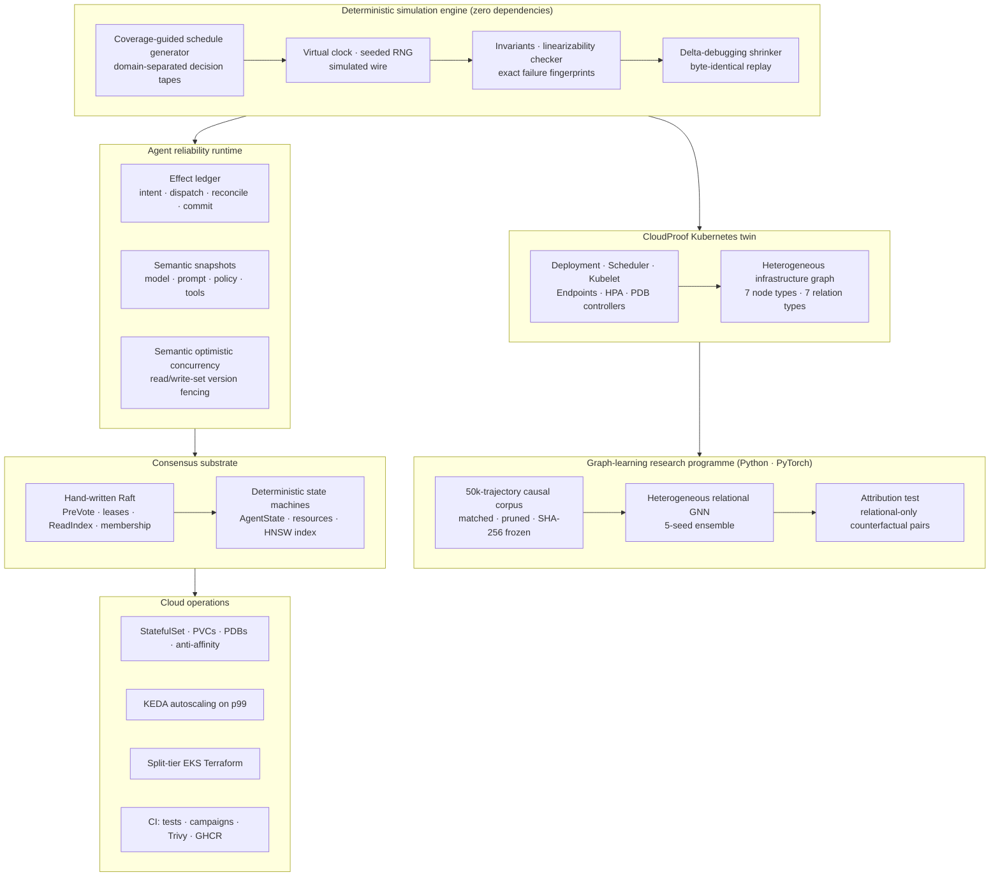

<<<<<<< Updated upstream
# miniRaft Agent Reliability Lab
=======
# CloudProof
>>>>>>> Stashed changes

**Deterministic simulation testing for distributed systems, autonomous AI agents and Kubernetes operations: a hand-written Raft engine at the bottom, a statistically validated graph neural network at the top, and one idea connecting them.**

> Find the exact schedule that breaks a system. Shrink it to the few actions that matter. Replay it byte-for-byte. Then learn to predict it, and prove what the model actually learned.

[](https://github.com/RaghhavMalani/cloudproof/actions/workflows/ci.yml)


---

## Contents

<<<<<<< Updated upstream
- `AgentExecution`: portable checkpoints containing the workflow cursor, state, semantic snapshot, history, and effect ledger.
- `EffectLedger`: stable effect identities and explicit `INTENT_RECORDED`, `RECONCILIATION_REQUIRED`, `RESULT_RECORDED`, and `EFFECT_COMMITTED` states.
- Semantic snapshots: versioned model, prompt, policy, retrieval index, and tool-schema resources with configurable resume decisions.
- Versioned shared resources: durable business state, execution-scoped read/write sets, and atomic resource-version fencing before effect authorization.
- Deterministic refund workload: one causal trace with execution-scoped invariants and plain-English replay.
- Decision tapes, fault schedules, invariant checking, causal flight recording, and trace shrinking from the existing miniRaft lab.

> **Current milestone:** miniRaft now searches interleavings among three
> autonomous workflows over shared order state, kills four deliberate race
> mutants, shrinks each violation to six causal actions, and fences the promoted
> race in the live Raft cluster. See
> [MULTI-AGENT-RACE-DETECTION.md](MULTI-AGENT-RACE-DETECTION.md).
=======
1. [At a glance](#at-a-glance)
2. [The thesis](#the-thesis)
3. [System architecture](#system-architecture)
4. [Raft consensus engine](#1-raft-consensus-engine-from-scratch)
5. [Deterministic simulator, search, shrink and replay](#2-deterministic-simulator-search-shrink-and-replay)
6. [Agent reliability runtime](#3-agent-reliability-runtime)
7. [Autonomous counterexample search](#4-autonomous-counterexample-search)
8. [Multi-agent race detection](#5-multi-agent-race-detection)
9. [CloudProof: an executable Kubernetes twin](#6-cloudproof-an-executable-kubernetes-twin)
10. [The graph-learning research programme](#7-the-graph-learning-research-programme)
11. [Retrieval and model serving](#8-retrieval-and-model-serving)
12. [Streaming substrate](#9-deterministic-streaming-substrate)
13. [Infrastructure, operations and CI](#10-infrastructure-operations-and-ci)
14. [Engineering principles](#engineering-principles)
15. [Résumé highlights](#résumé-highlights)
16. [Run it](#run-it)
17. [Repository map](#repository-map)
18. [Honest limits](#honest-limits)

---
>>>>>>> Stashed changes

## At a glance

| | |
|---|---|
| **Scale** | ~47,700 lines of hand-written code (41,700 source, 6,000 test) across JavaScript, Python, Terraform, Kubernetes YAML and shell; 29 commits and 5 merged feature branches |
| **Tests** | **265 automated tests** (157 Node, 69 Raft/retrieval, 39 Python/PyTorch), plus 6 search-and-mutant campaigns, 2 corpus smoke gates, Trivy scans of 4 container images and a live three-node Raft campaign in CI |
| **Consensus** | Raft written from scratch: PreVote, leader leases, ReadIndex, learner-based membership changes, durable term/vote/log with crash recovery, CAS, watches and Prometheus metrics |
| **Bug finding** | Every injected defect found: **10/10** seeded Raft bugs, **5/5** agent-runtime mutants, **4/4** multi-agent race mutants, **3/3** Kubernetes-controller mutants. The correct runtimes show zero violations across 1,000-schedule campaigns |
| **Minimization** | Median **84%** schedule reduction for Raft; counterexamples shrunk **16 → 5**, **29 → 6** and **34 → 3** actions; **100%** byte-identical deterministic replay |
| **Speed** | **321,579×** virtual time per real second; 2.17 µs per invariant check |
| **Data** | A **50,000-trajectory** outcome-blind corpus: **5.93 M** simulated Kubernetes transitions, **180,170** training rows and **2,000** counterfactual topology pairs, frozen by SHA-256 |
| **ML result** | A heterogeneous GNN ranks relational-only counterfactuals correctly **87.3%** of the time (95% CI 82–92%, *p* = 7.4 × 10⁻²⁵). A topology-blind model is at **50%** by construction, edge rewiring destroys the effect, and it survives a clock-blind ablation. All five pre-registered criteria passed |
| **Retrieval** | Deterministic, Raft-replicated HNSW: recall@10 **99.8%**; int8 quantization at **3.88×** less memory with 98.3% recall; BM25 plus reciprocal rank fusion hybrid search |
| **Operations** | Kubernetes StatefulSet with per-replica PVCs, required anti-affinity and quorum-preserving PDBs; KEDA autoscaling on Prometheus p99 latency; split-tier EKS Terraform with a plan-time cost guard |

---

## The thesis

Most failures in distributed software are not bad code on a single machine. They are **bad interleavings**: a leader crash between two writes, a lost response after a payment succeeded, two individually correct agents acting on the same stale order, a node drain that lands mid-rollout. Such failures appear once a week, cannot be reproduced, and get closed as "flaky".

CloudProof turns them into ordinary, debuggable test failures with one pipeline, applied to three increasingly ambitious targets:

```text
seed ─► concrete schedule ─► deterministic execution ─► invariant checks
                                                            │
                        exact failure fingerprint ◄─────────┘
                                   │
          delta-debugging shrink (must fail for the SAME reason)
                                   │
          byte-identical replay artifact  +  generated regression test
                                   │
          graph dataset of every transition  ─►  learned risk model
                                   │
          causal attribution test: did the model learn the structure?
```

| Target | The question it answers |
|---|---|
| **A Raft cluster** | Does the consensus implementation stay safe under partitions, crashes, packet loss and membership churn? |
| **Autonomous AI agents** | Under crashes, ambiguous tool results, policy deployments and concurrent workers, does every side effect happen at most once and in causal order? |
| **Kubernetes operations** | Given a topology and an operational plan, can concurrent controller behaviour violate an SLO, even when every controller is individually correct? |

The final layer asks a research question most ML projects skip: **when the model gets the right answer, is it for the right reason?**

---

## System architecture



---

## 1. Raft consensus engine, from scratch

A complete Raft implementation (`replica/raft.js`, about 1,600 lines) with its replicated state machine, append-only durable log and HTTP RPC layer. Nothing is borrowed from an existing consensus library; the runtime dependencies are Express and axios.

| Concern | Implementation |
|---|---|
| **Crash safety** | Term, vote, append-only log and commit index are durable (fsync) before they are acknowledged; applied state is rebuilt deterministically from the committed prefix on restart |
| **Correct commit rule** | A leader advances to the highest `N` replicated on a majority **only** when `log[N].term === currentTerm` (Raft §5.4.2) |
| **Dynamic quorum** | Majority is `⌊n/2⌋ + 1`; the engine is not hard-coded to three nodes. A five-node cluster provably needs three votes |
| **Log repair** | `nextIndex` / `matchIndex` backtracking repairs divergent or lagging followers |
| **Real heartbeats** | Heartbeats are empty AppendEntries RPCs carrying `prevLogIndex`, `prevLogTerm` and `leaderCommit` |
| **Election stability** | **PreVote**: a prospective candidate must reach a majority before it may increase the durable term |
| **Safe reads** | Leader leases and **ReadIndex**; quorum-aware readiness stops a stale leader from serving |
| **Membership** | Learner promotion with one-server-at-a-time changes |
| **Retry safety** | Stable `clientId + seqNo`; a retried command resolves to the existing log entry instead of appending twice |
| **Coordination primitives** | Compare-and-set, leases and resumable watches in the replicated state machine |
| **Observability** | Prometheus: `cloudproof_elections_total`, `_prevotes_total`, `_current_term`, `_log_length`, `_commit_index`, `_ready`, `_commit_latency_ms` |

The first election normally completes within the randomized 500–800 ms election window. The same `raft.js` runs unchanged in the three-process Docker cluster, in Kubernetes and in the browser. In the browser only the clock and the network wire are substituted, which is what makes deterministic fuzzing possible.

**Tests prove the properties from the Raft paper:**
- a granted vote is durable before the reply is sent;
- committed logs and the applied index survive restart;
- retried commands never append twice;
- a replica count alone cannot commit an older-term entry;
- an empty heartbeat rejects divergence and advances the follower's commit index.

---

## 2. Deterministic simulator, search, shrink and replay

The core instrument: a discrete-event simulator with a virtual clock, seeded PRNG and simulated network. It runs the **real** protocol code under generated fault schedules.

1. A seed generates client operations, faults (partitions, packet loss, crashes, restarts) and membership changes.
2. The generator materializes those choices into a **portable JSON schedule**. From then on, execution never samples new randomness.
3. **Domain-separated decision tapes** record every election timeout, packet drop and latency draw.
4. A **coverage tracker** feeds unseen workload, fault, RPC, role and invariant features back into generation.
5. Invariant checks (election safety, log matching, state-machine safety, index agreement, quorum availability) and a **model-based linearizability checker** classify an exact failure predicate.
6. A **delta-debugging shrinker** removes chunks and single actions and reduces clients, writes, partitions, loss, churn, payloads and gaps. A smaller schedule is accepted **only if it fails for the same reason**.
7. The minimized trace ships with a causal "why?" explanation and a generated regression test.

**Measured campaign** (Node 24, Windows x64):

| Measure | Result |
|---|---:|
| Schedules explored per second | 23.1 |
| Virtual time per real second | **321,579×** |
| Target transition coverage | **16 / 16** |
| Seeded bugs rediscovered ("Bug Museum") | **10 / 10** |
| Median shrink ratio | **84%** |
| Shrink execution time | 9.8 ms |
| Deterministic replay success | **100%** |
| Flight-recorder overhead | 1.56× median runtime |
| Invariant-check cost | 2.17 µs per check |
| Resumable-watch recovery | 244 ms virtual, 938 ms in real Docker |

**The Flight Deck** is a browser lab that runs the real modules and has **11 deterministic workloads**, each with its own invariants:
- an autonomous refund agent;
- configuration coordination (CAS, leases, ReadIndex, watches);
- idempotent payments;
- tenant-filtered vector search;
- model rollout;
- live streaming;
- ride dispatch;
- flash-sale inventory;
- feed fan-out;
- CRDT collaborative editing;
- two-phase-commit settlement.

Each run renders a causal trace, an invariant HUD and a plain-English replay.

---

## 3. Agent reliability runtime

**Thesis: an AI agent is a distributed workflow with a nondeterministic decision-maker.** Saving chat history is not enough when an agent can refund money, update a CRM or deploy code. Recovery must preserve the workflow cursor, the identity of every tool effect, and the semantic assumptions the agent reasoned under.

| Primitive | What it guarantees |
|---|---|
| `AgentExecution` | Portable checkpoint: workflow cursor, state, semantic snapshot, history and effect ledger |
| `EffectLedger` | Stable effect IDs (SHA-256 of execution, action and canonical parameters) moving through `INTENT_RECORDED → EFFECT_DISPATCH_AUTHORIZED → RESULT_RECORDED → EFFECT_COMMITTED`, with `RECONCILIATION_REQUIRED` when an outcome is unknown |
| Semantic snapshots | Pin the model, prompt, policy, retrieval index and tool-schema versions; on resume, a change maps to `continue`, `revalidate`, `restart`, `require-approval` or `abort`, and the strictest applies |
| Raft persistence | The committed Raft log is the **only** source of truth for checkpoints and the ledger; a deterministic reducer applies it. There is no second database |
| Optimistic fencing | `expectedStep` fences reject a stale worker with `409 STALE_EXECUTION_VERSION` |

**The contract is exactly-once *observable* effect, not exactly-once delivery.** After a crash:
- an absent effect executes;
- a committed effect returns its recorded result;
- anything in between is **reconciled** by effect ID and never blindly retried.

**Live acceptance campaign** (`tools/agent-raft-compose-test.js`, run in CI). It uses a real three-node Raft cluster plus a separate refund-provider process with its own volume, which can destroy the socket *after* persisting a refund to create a genuinely ambiguous RPC. It verifies nine failure boundaries:
1. An uncommitted intent followed by leader death produces zero provider calls.
2. A committed intent followed by death before the call is reconciled as "not found", then refunded exactly once.
3. After a lost response plus leader death, the effect is looked up and **never refunded twice**.
4. A committed result followed by leader death finishes with no provider contact.
5. A committed effect followed by leader death returns the recorded result.
6. Of two simultaneous workers, exactly one advances.
7. A semantic conflict persists across failover, and an approved snapshot transition releases it.
8. All three replicas hold byte-equivalent checkpoints.
9. A full `docker compose down`/`up` recovers everything from the Raft logs.

---

## 4. Autonomous counterexample search

Hand-written failure stories prove little. This stage **searches** the agent's action and fault space and finds the failures itself.

- **Search language:** 7 logical actions (advance, authorize, dispatch, reconcile, result, commit, snapshot-approve) and 8 faults (worker crash, leader crash, dropped response, delayed response, racing worker, policy deployment, quorum loss and restore).
- **Reusable invariants:** at-most-once observable effect, no mutation without an authorized snapshot, semantic conflict blocks mutation, a stale worker cannot advance, unfinished effects survive recovery, causal effect order.
- **Structured failure identity:** the invariant, violation class, execution and the relevant effect, worker or resource. It is not a boolean.

| Injected mutant | Failure class | Schedules to find | Minimized actions |
|---|---|---:|---:|
| `blind-retry` | `DUPLICATE_OBSERVABLE_EFFECT` | 1 | **5** |
| `dispatch-before-intent` | `UNTRACKED_EXTERNAL_EFFECT` | 1 | **1** |
| `no-worker-fence` | `CONCURRENT_EXECUTION_RACE` | 4 | **3** |
| `volatile-semantic-conflict` | `SEMANTIC_ISOLATION_VIOLATION` | 1 | **3** |
| `result-forgotten-on-resume` | `UNNECESSARY_RECONCILIATION` | 5 | **4** |

All five mutants were killed and correctly classified. A 1,000-schedule campaign against the correct runtime covered all 15 action and fault types with **zero violations**. The agent-aware shrinker reduced the blind-retry failure from 16 actions and 38 events to 5 actions and 15 events. Its replay artifact reproduces byte-identically, and the live campaign replays that 5-action counterexample against a real three-node Raft log.

---

## 5. Multi-agent race detection

**Two individually correct agents can still produce a globally wrong result.** Three frozen, deterministic workflows reason about the same order, `order:4821@17`:
- a **refund agent** decides on a full refund;
- a **fraud-review agent** decides on a chargeback;
- a **customer-recovery agent** decides on goodwill credit.

Each decision is valid on its own. Together they over-compensate the customer.

**Fix: semantic optimistic concurrency inside the Raft state machine.** Each execution durably records a `readSet` (the resource versions it reasoned over) and a `writeSet` of deterministic operations (`set`, `increment`, `append-unique`). The transition `agent.effect.authorize-resource` validates every read version atomically **before** authorizing the effect or applying any write:

```text
<<<<<<< Updated upstream
Autonomous agent / recorded decision tape
                 │ logical action intent
                 ▼
       miniRaft agent runtime
          │              │
          ▼              ▼
 semantic snapshot    effect ledger
 model · prompt       intent · result
 policy · retrieval  reconciliation · commit
 tools · schemas          │
          └──────┬────────┘
                 ▼
 durable checkpoint boundary
                 │
        deterministic fault lab
                 │
     invariants · replay · shrink
=======
RESOURCE_VERSION_CONFLICT   expected order:4821@17   actual order:4821@18   decision REVALIDATE
>>>>>>> Stashed changes
```

| Race mutant | Broken boundary | Failure class |
|---|---|---|
| `authorize-stale-read` | Authorization recorded before the stale-version check | `STALE_SHARED_RESOURCE_READ` |
| `unfenced-compensation` | Recovery credits from stale order state | `OVER_COMPENSATION` |
| `unfenced-terminal-transition` | A second terminal state from stale state | `MUTUALLY_EXCLUSIVE_TERMINALS` |
| `split-financial-owner-commit` | Ownership changes before validation completes | `DOUBLE_FINANCIAL_OWNER` |

All four were killed. Each was minimized from a 29-action interleaving to **6 actions**, and each replays byte-identically. **1,000 corrected schedules ran with zero violations.** The minimized over-compensation race is replayed against the **live** three-node cluster: the second authorization is rejected, and every replica converges on exactly ₹8,999 of compensation, one terminal state and one financial owner, including after a full cluster restart.

---

## 6. CloudProof: an executable Kubernetes twin

> Given a Kubernetes topology and an operational plan, deterministically explore concurrent controller behaviour, find and minimize an SLO-violating interleaving, and export every transition as graph training data.

**What is modelled:**
- node CPU, memory, readiness, zones, taints and tolerations;
- the pod lifecycle `PENDING → STARTING → RUNNING → READY` in virtual time;
- Deployment rollouts with `maxSurge`/`maxUnavailable`;
- delayed Service-endpoint propagation;
- HPA metric delay, stabilization and bounded recommendations;
- PDB admission for voluntary drains.

**Operations:** roll out, roll back, scale, drain, recover, advance time, traffic spike.

**Faults:** node crash or drain, zone degradation, readiness and image-pull delay, stale HPA metrics, endpoint delay, controller restart.

**Deliberately excluded:** ReplicaSets as graph nodes, the CNI/DNS dataplane, volumes, preemption, webhooks and CRDs. The model is kept small enough for exhaustive schedule work.

**Graph schema.** Seven node types (`Node`, `Pod`, `Deployment`, `Service`, `HPA`, `PDB`, `Zone`) and seven relation types (`OWNS`, `RUNS_ON`, `ROUTES_TO`, `LOCATED_IN`, `SELECTS`, `PROTECTS`, `SCALES`). Every action and virtual-clock callback emits a `(state, action, next state, labels)` row.

**Flagship result.** With **every controller implemented correctly**, a 34-action operational plan still violates rollout availability. The shrinker reduces it to **3 actions**:

```text
cloud.action.roll-out  →  cloud.controller.deployment  →  cloud.action.drain-node
ROLLOUT_AVAILABILITY_VIOLATION   deployment/api   expected 5 ready, observed 4
```

A benchmark kills three controller mutants: `endpoint-includes-unready` routes traffic to an unready pod, `rollout-ignores-terminating` breaks the availability budget, and `hpa-stale-indefinitely` causes an autoscaler capacity mismatch. It also runs 1,000 corrected schedules. A replay adapter (`tools/cloudproof-kind-replay.js`) re-executes a minimized plan on a real kind cluster and compares the observed failure fingerprint with the predicted one.

---

## 7. The graph-learning research programme

The most substantial part of the project is a multi-phase ML study. It deliberately includes a **negative result**: a self-audit found that the first headline number was not what it appeared to be. The benchmark was rebuilt until the question could be answered honestly.

### The arc

| Phase | What happened | Outcome |
|---|---|---|
| **II-A** | Built a 10,000-simulation research corpus with topology-held-out splits (train A–H, validation, unseen test topologies, and an **OOD** split at 8–12 replicas versus 3–6 in training) and leakage-safe baselines | Reproducible benchmark |
| **II-B** | Implemented a heterogeneous relational GNN in plain PyTorch (no graph library) as a schedule-risk ranker | Test AUROC **0.98**: looked like a win |
| **II-B.1** | **Audited my own result.** A parameter-matched *topology-blind* pooled MLP scored *higher* (0.989 vs 0.983). Randomizing every graph edge left the fixed-budget ranking unchanged. Safe and unsafe trajectories differed *by construction* (42.0 vs 6.0 mean actions; 0% vs 100% fault presence). Even a model trained on permuted labels scored AUROC 0.69 | **Negative result, preserved.** The gain was construction leakage, not topology learning |
| **II-A.2** | Rebuilt the data from first principles (details below) | A corpus that no longer hands any model a free answer |
| **II-B.2** | Retrained the **unchanged** architecture on the frozen corpus and ran a **pre-registered attribution test** | **Graph attribution passed** |

### Rebuilding the corpus (II-A.2)

- **Outcome-blind generation.** A single code path samples topology, traffic, placement, fault hazard and operations. The generator cannot see or steer the outcome; tests scan its source for any outcome-control surface.
- **Scale.** **50,000 trajectories** and **5,934,217 simulated transitions**, generated in 991 s on 14 worker threads; all 9,712 selected trajectories were re-executed and their replay fingerprints verified.
- **Nuisance matching and adversarial pruning.** Safe and unsafe trajectories were matched 1:1 in hierarchical strata. An AFLite-style loop, using a cross-fitted probe, then pruned the most nuisance-predictable pairs, taking the probe's AUROC from **0.74 to 0.53**. Result: 4,856 matched pairs (9,712 trajectories), with the largest standardized mean difference **0.12**.
- **Row-level de-biasing.** A label-blind row cap and position balancing removed the remaining "long schedule" and "row index" shortcuts. An incident-class cap keeps any single failure mode to at most 40% of the unsafe trajectories.
- **Shortcut and permutation gates.** A linear probe that sees only nuisance features must stay near chance (**0.53** pooled). Twelve label-permutation seeds must centre on 0.5; all three families' 95% intervals contain chance.
- **Fresh holdouts.** New test and OOD topologies that no earlier phase ever examined.
- **Counterfactual pairs.** 2,000 paired worlds share the seed, traffic and every exogenous action and differ in exactly one topology intervention. **1,111** of them are **relational-only**: both members have *identical* node features, action and flat risk features, and differ only in *which resource is connected to which*. **173** of those flip the deterministic outcome.
- **Freeze.** Every file is SHA-256 hashed into a committed freeze record, and every later experiment recomputes the hashes and aborts on any mismatch.

### The decisive experiment (II-B.2)

On the 173 relational-only pairs, a topology-blind model **cannot** do better than a coin flip, because its inputs are literally identical. The only way to rank the riskier member higher is to read the graph's wiring.

| Model | Correct | Ties | Accuracy | 95% CI | *p* vs chance |
|---|---:|---:|---:|---|---:|
| Pooled MLP (topology-blind) | 0 | 173 | **50.0%** | — | — |
| **Full GNN** | **151** | 0 | **87.3%** | [82.1%, 91.9%] | **7.4 × 10⁻²⁵** |
| GNN with all edges removed | 0 | 173 | 50.0% | — | — |
| GNN with edges uniformly rewired (3 seeds) | 80–95 | 0 | 46.2–54.9% | spans chance | 0.22–0.88 |
| **Clock-blind GNN** (absolute-time features masked) | **153** | 0 | **88.4%** | [83.8%, 93.1%] | 1.5 × 10⁻²⁶ |
| GNN heads trained independently for K = 1, 10, 20 | 150–154 | 0 | **86.7–89.0%** | lower bounds ≥ 81.5% | — |

All five criteria were **fixed in code before training** and all five passed:
1. the GNN beats chance with a CI lower bound above 0.5 and *p* < 0.01;
2. the pooled MLP is at chance;
3. destroying the edges costs at least 10 points, with a paired-bootstrap interval that excludes zero;
4. the effect survives removal of the clock features;
5. the intervals are determinate.

**A mechanistic finding: the model uses two different graph properties.**

| Edge intervention (seed 1729) | Node-concentration (n = 86) | Readiness-wiring (n = 55) |
|---|---:|---:|
| Intact graph | 96.5% | 92.7% |
| Degree-preserving permutation | **96.5%** (untouched; 95.3–96.5% over 3 seeds) | **55.5%** (destroyed; 50.9–55.5% over 3 seeds) |
| Uniform rewiring | 46.5% (destroyed) | 43.6% (destroyed) |

Node-concentration is a **degree** effect: how many pods sit on the node that crashes. Readiness-wiring is an **endpoint-identity** effect: which zone the not-yet-ready pods are wired to. This also explains why the earlier audit's only edge control, a degree-preserving permutation, could not detect the effect.

**Where the claim stops (and why that matters):**
- **Natural data.** On ordinary validation, test and OOD transitions, the topology-blind MLP matches the GNN in AUROC (test 0.787 vs 0.790; OOD 0.712 vs 0.722). The GNN is markedly better calibrated out of distribution (NLL 0.48 vs 0.71).
- **Fixed-budget verification.** On a matched 50/50 pool of 5,838 held-out schedules, **deterministic coverage-guided search beat every learned prioritizer** below a budget of 5,000 (608 vs 582 counterexamples at budget 1,000). The learned GNN ranker still sits 5.7 standard deviations above an uninformative ranking.
- **The supported claim is exactly this:** *relational topology contributes predictive information for CloudProof's controlled Kubernetes topology interventions.*

### Rigour, in practice

- **Pre-registration:** architecture, recipe, seeds, edge modes, masked features, trajectory rule and pass/fail criteria were constants written to disk before any model saw test data.
- **Leakage controls:** training reads only the train split. Validation is used only for early stopping. The member-training process cannot even *address* the test and OOD files, and a unit test proves that pair labels never reach the features.
- **Uncertainty:**
  - pairwise results use a 10,000-resample pair bootstrap, Wilson intervals, and exact binomial and McNemar tests;
  - transition AUROC intervals resample whole *trajectories*, not rows;
  - fixed-budget results are compared against the exact hypergeometric null.
- **Reproducibility:** 45 ensemble members were trained deterministically on a 24-thread laptop CPU with no GPU. The pipeline is resumable after interruption, and a full re-run reproduced every K = 5 statistic **byte-for-byte**.

Full reports: [Phase I](CLOUDPROOF.md) · [II-A](CLOUDPROOF-PHASE-II-A.md) · [II-B](CLOUDPROOF-PHASE-II-B.md) · [II-B.1 audit](CLOUDPROOF-PHASE-II-B1-ATTRIBUTION-AUDIT.md) · [II-A.2 corpus](CLOUDPROOF-PHASE-II-A2-CAUSAL-CORPUS.md) · [**II-B.2 attribution**](CLOUDPROOF-PHASE-II-B2.md)

---

## 8. Retrieval and model serving

A hand-written retrieval stack whose index is **replicated through Raft**. The index is a deterministic state machine, so every replica applies the same committed log and ends up with the same graph.

| Component | Measured result |
|---|---|
| **HNSW** approximate nearest-neighbour index | recall@10 **99.8%** (50 queries, 1,000 vectors); **100%** after deleting 25% of vectors via tombstones |
| **Determinism** | Three independently built indexes serialize to **byte-identical** graphs; levels are seeded solely from the vector ID; a checksum detects divergent mutations |
| **int8 quantization** | **3.88×** smaller (750 KB → 193 KB) at **98.3%** recall versus 99.5% for float32 |
| **Binary quantization** | **32×** smaller; binary traversal with float rescoring recovers accuracy (asserted recall ≥ 85%) |
| **Filtered search** | Tenant filters applied *inside* the graph walk stay accurate (asserted ≥ 95%) where post-filtering collapses, with an exact-scan fallback for very selective filters |
| **BM25 + reciprocal rank fusion** | Hybrid search beats either half on its own on a mixed query set; BM25 catches exact tokens such as `ERR_CONNECTION_REFUSED` that embeddings blur |

**Serving tier.**
- **Embeddings:** `all-MiniLM-L6-v2` (384-dimensional) via ONNX Runtime on CPU with no API key, plus a deterministic hash-embedding fallback.
- **Atomic model swaps:** index artifacts live in S3/MinIO while the Raft log holds only a versioned manifest (version, object key, checksum). Swapping the model is one atomic pointer flip that never touches the consensus layer.
- **Measurement tools:** a cold-start benchmark breaks start-up into pre-process, runtime init, discovery, fetch, verify and parse phases. A cost model plots cost per thousand queries against QPS, self-hosted versus managed.

---

## 9. Deterministic streaming substrate

A Kafka-like substrate built to make **event-time correctness** testable:
- keyed partitions with per-partition offsets and ordering;
- consumer groups with committed offsets and deterministic rebalances;
- retention with loud `OFFSET_OUT_OF_RANGE` errors;
- an at-least-once mode that exposes double effects;
- an exactly-once in-memory transaction that publishes effects and offsets together;
- bounded-out-of-orderness **watermarks**;
- tumbling and sliding **event-time windows** with idle-partition detection and drop, side-output or update policies for late data.

No window boundary ever reads processing time.

---

## 10. Infrastructure, operations and CI

**Three execution surfaces, deliberately distinct:**

| Surface | What runs | What it proves |
|---|---|---|
| **Browser lab** | The real `raft.js`, `hnsw.js` and state-machine modules behind a virtual clock and simulated wire | Deterministic replay and workload invariants |
| **Docker Compose** | Three Raft processes with named volumes, gateways, Redis and a refund provider | Real processes, DNS, sockets, fsync, restart and persistence |
| **Kubernetes (kind)** | A four-node cluster: one system node and three tainted consensus workers | Stable identity, scheduling, storage and quorum-safe disruption |

**Kubernetes.**
- A StatefulSet with headless-service DNS, a dedicated 1 Gi PVC per replica, and **required pod anti-affinity** (one replica per node).
- Taints and tolerations that keep serving pods off the consensus nodes.
- `/health` liveness and `/ready` quorum-lease readiness probes.
- A **PodDisruptionBudget that preserves quorum** during voluntary maintenance.
- Two gateway replicas with Redis pub/sub fan-out of committed entries.
- Non-root containers with dropped capabilities and read-only root filesystems.

**Autoscaling.** KEDA scales the serving tier from **3 to 9** pods on **Prometheus p99 query latency** (target under 25 ms) rather than on CPU. CPU can sit at 40% while p99 triples.

**Observability.** Prometheus scraping plus a provisioned Grafana dashboard.

**Terraform: split-tier EKS.**
- **Consensus tier:** managed EC2 node groups with gp3 EBS volumes.
- **Serving tier:** a Fargate profile that scales to zero.
- **Supporting pieces:** separate read and write **IRSA** roles, S3 for index artifacts, Secrets Manager, and a small untainted system node group so that CoreDNS and the EBS CSI controller can schedule.
- **Cost guard:** a `validation` block refuses `terraform apply` without explicit cost acknowledgement (about $174/month at idle, $73 of it for the EKS control plane). The whole stack otherwise runs locally for **$0**.

**CI (GitHub Actions)** runs on every pull request and push to `main`:
- **Test job:**
  - every simulator and unit test suite;
  - six search and mutant campaigns;
  - the CloudProof twin acceptance gate and two corpus smoke gates;
  - a syntax check of every module and a check that generated web assets are current.
- **Container job:** builds four images (replica, gateway, refund provider, embedding service) and fails the build on any fixable **HIGH or CRITICAL Trivy** finding. On `main` it publishes commit-pinned and `latest` tags to **GHCR**.
- **Live job:** the three-node Raft crash-boundary and single- and multi-agent counterexample campaign.

---

## Engineering principles

- **Determinism first.** Randomness enters only at schedule generation. Execution, shrinking and replay consume concrete actions, so every failure is a file you can re-run.
- **Exact failure identity.** Failures are structured fingerprints, not booleans. The shrinker rejects a smaller trace that fails *differently*.
- **Mutants prove the checker works.** Every search engine is gated on killing deliberately broken implementations *and* staying silent on the correct one.
- **Frozen evidence.** Research inputs are hash-frozen; every experiment re-verifies them and aborts on drift.
- **Pre-registration over p-hacking.** Pass/fail criteria are code constants written before results exist.
- **Negative results are kept.** The Phase II-B.1 audit that falsified the first headline number is preserved verbatim in the history.
- **Say exactly what is proved.** "Exactly-once observable effect", not "exactly-once delivery"; "quorum-aware serving", not "CheckQuorum"; "topology helps on controlled interventions", not "GNNs beat baselines".

---

## Résumé highlights

**One-line summary**

> Built **CloudProof**, a ~48k-line deterministic-simulation testing platform for distributed systems, autonomous AI agents and Kubernetes operations: a hand-written Raft engine, coverage-guided fault search with delta-debugging shrinking and byte-identical replay, a Kubernetes digital twin, and a PyTorch graph neural network validated with a pre-registered causal attribution study.

**Bullet points** (each claim is backed by a test, a benchmark or a result file in this repository)

- Implemented **Raft consensus from scratch** in Node.js: PreVote, leader leases, ReadIndex, learner-based membership changes, durable term/vote/log with crash recovery, CAS and watches. Deployed it as a **Kubernetes StatefulSet** with per-replica PVCs, required anti-affinity and quorum-preserving PodDisruptionBudgets, instrumented with **Prometheus**.
- Built a **deterministic simulation and fault-injection engine** (virtual clock, seeded decision tapes, linearizability checker, delta-debugging shrinker) running at **321,579×** real time. It rediscovered **10/10 seeded consensus bugs**, cut failing schedules by a median of **84%**, and replayed them **byte-identically** in 100% of runs.
- Designed an **exactly-once-observable-effect runtime for autonomous AI agents** (effect ledger, semantic snapshot isolation, optimistic fencing) persisted through Raft. A **coverage-guided counterexample search** killed **5/5** injected runtime mutants with **zero false positives** across 1,000 schedules of the correct runtime.
- Detected **multi-agent shared-state races** using **semantic optimistic concurrency** (read/write-set version fencing inside the Raft state machine). It killed **4/4** race mutants and minimized each from **29 to 6 actions**, then validated the fix against a live three-node cluster through crash and restart.
- Built an **executable Kubernetes twin** (Deployment, scheduler, kubelet, endpoints, HPA and PDB controllers). It showed that a plan can violate rollout availability even with **correct controllers**, shrinking the counterexample from **34 to 3 actions**, and it exports every transition as heterogeneous-graph training data.
- Led a **pre-registered causal-attribution study** of a **PyTorch heterogeneous GNN**:
  - audited my own benchmark and found construction leakage, since a topology-blind model matched the GNN's 0.98 AUROC;
  - rebuilt a **50,000-trajectory, 5.9 M-transition** outcome-blind corpus with nuisance matching, adversarial pruning and SHA-256 freezing;
  - showed the GNN ranks **relational-only counterfactuals at 87.3%** against **50%** for a topology-blind baseline (*p* = 7.4 × 10⁻²⁵), an effect destroyed by edge rewiring and robust to a clock-blind ablation.
- Implemented a **Raft-replicated, deterministic vector-retrieval stack**: HNSW, int8/binary quantization, filtered search, and BM25 + reciprocal rank fusion hybrid. It reaches **99.8% recall@10** and uses **3.88× less memory** at 98.3% recall, and three independently built replicas serialize to **byte-identical** index graphs.
- Wrote **Terraform for split-tier AWS EKS** (EC2 node groups for consensus, Fargate for serving, IRSA, S3, Secrets Manager) with a plan-time cost guard. Configured **KEDA autoscaling on p99 latency** and a **GitHub Actions** pipeline with six search campaigns, **Trivy** image scanning and **GHCR** publishing.

**Skills demonstrated**

*Distributed systems:* Raft, consensus, linearizability, leases, ReadIndex, membership changes, optimistic concurrency, exactly-once semantics, idempotency, deterministic simulation testing, fault injection, delta debugging, event-time stream processing, watermarks.

*Machine learning and statistics:* PyTorch, graph neural networks (heterogeneous message passing), ensembles, calibration (ECE, Brier, NLL), AUROC/AUPRC, leakage auditing, counterfactual evaluation, nuisance matching, adversarial filtering (AFLite), bootstrap confidence intervals, exact binomial and McNemar tests, pre-registration, ablations.

*Retrieval:* HNSW, vector quantization (int8, binary), BM25, reciprocal rank fusion, filtered ANN search, ONNX Runtime, sentence embeddings.

*Cloud and DevOps:* Kubernetes (StatefulSets, PVCs, PDBs, anti-affinity, taints, probes), kind, KEDA, Prometheus, Grafana, Docker, Docker Compose, Terraform, AWS (EKS, Fargate, IRSA, S3, Secrets Manager), GitHub Actions, Trivy, GHCR.

*Languages:* JavaScript (Node.js 24), Python 3.12, HCL, YAML, Bash.

---

## Run it

Everything below runs locally and costs nothing. Node 24 is the only requirement for the simulator; Docker is needed for the live cluster.

```bash
# Raft + gateway cluster with durable volumes → http://localhost:4000
docker compose up --build

# Browser Flight Deck (static; real modules under a virtual clock)
node tools/build-web.js && npx serve web

# Consensus schedule search: search, shrink, replay
node sim/search.js --runs 100
node sim/search.js --seed 1337 --verbose

# Agent counterexample search and mutant benchmark
node sim/agent-search.js --workflow refund --runs 10000 --seed 1337
node sim/agent-search.js --benchmark --runs 100 --seed 1337

# Multi-agent race search and mutant benchmark
node sim/multi-agent-search.js --benchmark --runs 100 --seed 1337

# Live three-node Raft crash-boundary campaign (Docker)
node tools/agent-raft-compose-test.js

# Kubernetes twin: find, shrink and replay the flagship counterexample
node tools/cloudproof.js search --seed 1337 --runs 1
node tools/cloudproof.js replay --file artifacts/cloudproof/failure-1337.json

<<<<<<< Updated upstream
See [CLOUDPROOF.md](CLOUDPROOF.md) for the modeled Kubernetes boundary, graph
schema, mutants, dataset contract, and sim-to-real workflow.

### CheckQuorum: the important distinction

miniRaft does not claim full CheckQuorum semantics. An isolated leader retains
its LEADER role until it sees a higher term. Quorum-aware readiness, leader
leases, ReadIndex, and commit rules still prevent it from safely serving reads
or committing writes after majority contact is lost. PreVote and the recent-
leader vote rule prevent isolated or removed followers from needlessly
disrupting a healthy term.

That behavior is safe for the interfaces exposed here, but it is observably
different from an implementation that automatically demotes a leader after a
quorum timeout. The status API labels it accurately as quorum-aware serving and
disruption prevention.

## Kubernetes

For a complete local Kubernetes deployment, use the checked-in kind harness:

```bash
=======
# Full local Kubernetes (kind): StatefulSet, PVCs, KEDA, Prometheus, Grafana
>>>>>>> Stashed changes
bash tools/kind-up.sh

# Graph-learning attribution pipeline (needs the frozen corpus; see CLOUDPROOF-PHASE-II-B2.md)
python -m pip install -r ml/cloudproof/requirements.txt
python -m ml.cloudproof.phase_ii_b2 verify
python -m ml.cloudproof.phase_ii_b2 train --horizons 5
python -m ml.cloudproof.phase_ii_b2 evaluate && python -m ml.cloudproof.phase_ii_b2 pairs

# Test suites
node --test sim/*.test.js packages/*/*.test.js refund-provider/*.test.js tools/*.test.js
(cd replica && npm ci && npm test)
python ml/cloudproof/tests/run_tests.py
```

<<<<<<< Updated upstream
It builds and side-loads local images, creates three consensus worker nodes,
adapts the production storage class, deploys the system, and waits for the
StatefulSets and Deployments. It requires Docker, `kind`, `kubectl`, and Bash.
This is the easiest way to see stable pod identities, PVC recovery, required
anti-affinity, readiness gating, and quorum-safe PodDisruptionBudgets working
without a cloud account. See [README-DEPLOY.md](README-DEPLOY.md) for the exact
difference between the browser simulator, Compose cluster, and Kubernetes.

The checked-in manifest expects the two images produced by the GitHub Actions workflow:

- `ghcr.io/raghhavmalani/miniraft-replica:latest`
- `ghcr.io/raghhavmalani/miniraft-gateway:latest`

Deploy:

```bash
kubectl apply -f k8s/miniraft.yaml
kubectl -n miniraft get pods
kubectl -n miniraft get service gateway
```

The replica StatefulSet provides:

- stable identities such as `raft-0.raft`;
- headless-service peer discovery;
- a dedicated 1 Gi PVC per node;
- `/health` liveness and `/ready` quorum-lease readiness probes;
- Prometheus scrape annotations on `/metrics`;
- a PodDisruptionBudget that preserves the two-member quorum during voluntary maintenance;
- non-root containers with dropped Linux capabilities and read-only root filesystems.

The gateway deployment runs two replicas behind one Service. Redis pub/sub fans committed entries across both WebSocket client sets.

## Metrics

Each replica exposes Prometheus text format at `/metrics`:

```text
miniraft_elections_total
miniraft_prevotes_total
miniraft_current_term
miniraft_log_length
miniraft_commit_index
miniraft_ready
miniraft_commit_latency_ms
```

For the local Compose network, a ready-to-use scrape configuration is in `monitoring/prometheus.yml`.

Useful endpoints:
=======
**Replica HTTP API**
>>>>>>> Stashed changes

| Endpoint | Purpose |
|---|---|
| `GET /status` · `/log` · `/health` · `/ready` · `/metrics` | Node state, stored log, liveness, quorum-lease readiness, Prometheus |
| `POST /pre-vote` · `/request-vote` · `/append-entries` | Raft RPCs |
| `POST /agent/commands` | Commit agent execution plans and resource-fenced effect authorizations |
| `GET /agent/executions/:id` · `/agent/resources/:id` | Linearizable checkpoint and versioned-resource reads |

---

## Repository map

```text
<<<<<<< Updated upstream
miniRaft/
├── .github/workflows/ci.yml
├── docker-compose.yml
├── frontend/                  # cinematic consensus-lab UI
├── gateway/                   # HTTP/WebSocket routing + Redis fan-out
├── k8s/miniraft.yaml          # StatefulSet, PVCs, gateways, Redis, Services
├── monitoring/prometheus.yml
└── replica/
    ├── raft.js                # consensus engine
    ├── raft.test.js           # protocol-focused tests
    ├── index.js               # RPC, health, readiness, metrics
    └── docker-entrypoint.sh   # StatefulSet peer discovery
=======
cloudproof/
├── replica/            Raft engine, durable log store, state machines, HNSW, quantization, BM25
├── gateway/            WebSocket/HTTP routing, leader discovery, Redis commit fan-out
├── sim/                Deterministic simulator, schedule generators, searchers, shrinkers, corpus pipeline
├── packages/
│   ├── simulator/      Invariants, linearizability checker, flight recorder, explanations
│   ├── agent-runtime/  Effect ledger, semantic snapshots, agent checkpoints
│   ├── cloudproof/     Kubernetes twin: resources, controllers, graph, invariants, nuisance, pairs
│   ├── workloads/      Eleven deterministic Flight Deck workloads
│   └── stream/         Partitioned log, consumer groups, watermarks, event-time windows
├── ml/cloudproof/      PyTorch GNN, tensorizer, training, attribution, statistics (plus tests)
├── serving/            Embedding service, ONNX/hash embedders, S3 artifact loader
├── apps/ · web/        Browser Flight Deck, Bug Museum and generated static build
├── k8s/                Raft StatefulSet, serving tier, CloudProof flagship, kind, KEDA, MinIO, monitoring
├── infra/terraform/    Split-tier EKS, IRSA, S3, Secrets Manager, cost guard
├── tools/              CLIs: search, benchmarks, corpus, freeze, kind replay, cold-start, cost model
└── artifacts/          Committed counterexamples, fixtures and research results
>>>>>>> Stashed changes
```

---

## Honest limits

These boundaries are stated so that every claim above maps to code that can be explained line by line.

- **Raft** has no snapshots or log compaction. Membership uses learner promotion and one-at-a-time changes, not joint consensus. Losing quorum fences safe serving but does not implement automatic CheckQuorum leader demotion.
- **Agent guarantees** require the external tool to accept a stable effect ID idempotently, or to offer a lookup by that ID. The refund provider is a real separate service; the CRM and mail steps are deterministic workflow state.
- **The Kubernetes twin** models a single-service control plane. Its counterfactual pairs establish *simulator-level* causality. The kind replay adapter is implemented, but no recorded real-cluster run is checked in.
- **The graph-learning result** is established for controlled topology interventions only. On the natural corpus the topology-blind model is statistically indistinguishable in AUROC, and deterministic coverage search remains the strongest verification prioritizer. The effect is concentrated in two of four intervention families, and the model ranks all nine "unsafe → safe" flips wrongly.
- **The Terraform** is reference infrastructure and has not been applied. IRSA, Fargate cold starts and EBS zonal behaviour are therefore not exercised by the local $0 stack.
- **Diagnosis time** with and without the Flight Deck has not been measured in a user study; that field is recorded as `not-collected` rather than inferred.
- The next scientific step is a **multi-service dependency topology**, giving graph models richer relational structure than one service can offer.
