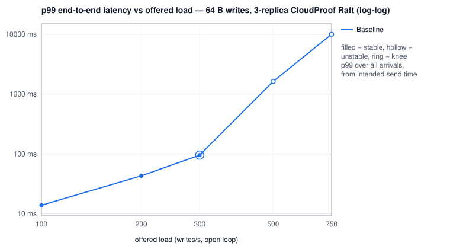
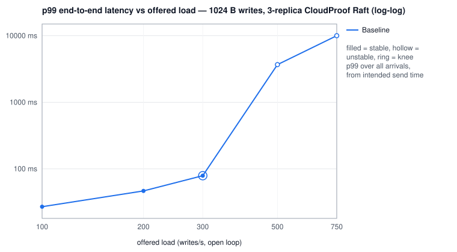
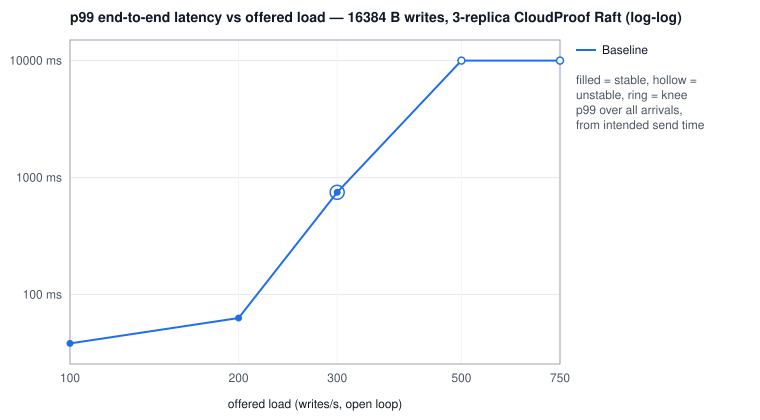

# Phase IV-A generated benchmark report

_Generated by `node tools/raft-bench-report.js` from the raw trial records. Do not edit by hand._

## Saturation knees

| configuration | payload | knee (offered/s) | max stable (achieved/s) | first unstable/s | peak achieved at any rate/s | p50 @knee ms | p99 @knee ms | p99.9 @knee ms |
|---|---:|---:|---:|---:|---:|---:|---:|---:|
| Baseline | 64 B | 300 | 300 | 500 | 580 | 44.00 | 95.61 | 103.49 |
| Baseline | 1024 B | 300 | 300 | 500 | 658 | 47.55 | 78.78 | 86.78 |
| Baseline | 16384 B | 300 | 297 | 500 | 442 | 10.16 | 748.54 | 874.50 |

## Configuration comparison — 64 B

| configuration | max stable ops/s | p99 @50% ms | p99 @80% ms | p99 @knee ms | leader CPU % @knee | CPU µs/op | fsync+meta per op | AE RPC per op | entries/AE | repl bytes/op |
|---|---:|---:|---:|---:|---:|---:|---:|---:|---:|---:|
| Baseline | 300 | 82.37 | 76.16 | 95.61 | 28 | 921 | 2.699 | 0.648 | 5.5 | 783 |

## Configuration comparison — 1024 B

| configuration | max stable ops/s | p99 @50% ms | p99 @80% ms | p99 @knee ms | leader CPU % @knee | CPU µs/op | fsync+meta per op | AE RPC per op | entries/AE | repl bytes/op |
|---|---:|---:|---:|---:|---:|---:|---:|---:|---:|---:|
| Baseline | 300 | 42.56 | 70.14 | 78.78 | 29 | 971 | 2.607 | 0.606 | 5.7 | 2,666 |

## Configuration comparison — 16384 B

| configuration | max stable ops/s | p99 @50% ms | p99 @80% ms | p99 @knee ms | leader CPU % @knee | CPU µs/op | fsync+meta per op | AE RPC per op | entries/AE | repl bytes/op |
|---|---:|---:|---:|---:|---:|---:|---:|---:|---:|---:|
| Baseline | 297 | 10.91 | 78.91 | 748.54 | 52 | 1739 | 3.003 | 0.750 | 5.8 | 33,537 |

## CPU profiles (leader)

| profile | offered/s | achieved/s | busy % of wall | fs-sync-io | axios | express | node-http | streams-net | json | console-logging | raft-engine | raft-log-store | raft-transport | state-machine | gc | instrumentation |
|---|---:|---:|---:|---:|---:|---:|---:|---:|---:|---:|---:|---:|---:|---:|---:|---:|
| baseline 1024 B A-sub-saturation | 150 | 150 | 38.5 | 55.0 | 10.9 | 3.1 | 6.8 | 7.9 | 0.3 | 2.6 | 3.2 | 0.5 | 0.0 | 0.5 | 0.8 | 0.7 |
| baseline 1024 B B-knee | 300 | 300 | 63.4 | 61.6 | 8.6 | 3.5 | 5.3 | 7.0 | 0.3 | 2.1 | 3.4 | 0.7 | 0.0 | 0.5 | 0.5 | 0.3 |
| baseline 1024 B C-overloaded | 500 | 494 | 98.0 | 87.4 | 1.0 | 2.3 | 1.1 | 1.8 | 0.0 | 1.8 | 1.3 | 0.6 | 0.0 | 0.2 | 0.1 | 0.2 |

Category columns are percent of *busy* (non-idle) sampled time on the leader.

## Saturation curves

**Baseline — 64 B payload** (knee 300/s; first unstable 500/s)

| offered/s | achieved/s | p50 ms | p95 ms | p99 ms | p99.9 ms | max ms | err % | stable | leader CPU % | ELU | fsync/s (cluster) | meta/s (cluster) | AE/s | entries/AE | repl B/op |
|---:|---:|---:|---:|---:|---:|---:|---:|:---:|---:|---:|---:|---:|---:|---:|---:|
| 100 | 100 | 4.09 | 13.52 | 13.86 | 14.59 | 15.9 | 0.00 | 3/3 | 22 | 0.28 | 279 | 270 | 179 | 1.1 | 2,165 |
| 200 | 200 | 21.63 | 36.67 | 43.01 | 49.25 | 57.2 | 0.00 | 3/3 | 21 | 0.78 | 400 | 330 | 200 | 2.5 | 1,056 |
| 300 | 300 | 44.00 | 83.58 | 95.61 | 103.49 | 120.6 | 0.00 | 3/3 | 28 | 0.86 | 494 | 316 | 195 | 5.5 | 783 |
| 500 | 494 | 280.57 | 1329.15 | 1628.16 | 1771.52 | 1847.7 | 0.00 | 1/3 | 27 | 0.95 | 642 | 250 | 149 | 38.5 | 505 |
| 750 | 580 | 4907.01 | 9420.80 | 10002.43 | 10002.43 | 10023.8 | 5.80 | 0/3 | 28 | 1.00 | 677 | 182 | 94 | 44.5 | 400 |

**Baseline — 1024 B payload** (knee 300/s; first unstable 500/s)

| offered/s | achieved/s | p50 ms | p95 ms | p99 ms | p99.9 ms | max ms | err % | stable | leader CPU % | ELU | fsync/s (cluster) | meta/s (cluster) | AE/s | entries/AE | repl B/op |
|---:|---:|---:|---:|---:|---:|---:|---:|:---:|---:|---:|---:|---:|---:|---:|---:|
| 100 | 100 | 4.63 | 22.00 | 26.98 | 29.36 | 35.7 | 0.00 | 3/3 | 21 | 0.36 | 268 | 256 | 168 | 1.2 | 3,854 |
| 200 | 200 | 21.84 | 38.37 | 46.56 | 54.27 | 57.3 | 0.00 | 2/3 | 24 | 0.74 | 389 | 309 | 189 | 2.5 | 2,917 |
| 300 | 300 | 47.55 | 69.69 | 78.78 | 86.78 | 96.1 | 0.00 | 3/3 | 29 | 0.87 | 482 | 300 | 182 | 5.7 | 2,666 |
| 500 | 467 | 730.11 | 3497.98 | 3676.16 | 3727.36 | 3741.0 | 0.00 | 1/3 | 33 | 0.96 | 602 | 233 | 136 | 43.7 | 2,409 |
| 750 | 658 | 1560.58 | 9207.81 | 10002.43 | 10002.43 | 10027.6 | 8.70 | 1/3 | 45 | 0.99 | 748 | 177 | 90 | 34.6 | 2,322 |

**Baseline — 16384 B payload** (knee 300/s; first unstable 500/s)

| offered/s | achieved/s | p50 ms | p95 ms | p99 ms | p99.9 ms | max ms | err % | stable | leader CPU % | ELU | fsync/s (cluster) | meta/s (cluster) | AE/s | entries/AE | repl B/op |
|---:|---:|---:|---:|---:|---:|---:|---:|:---:|---:|---:|---:|---:|---:|---:|---:|
| 100 | 100 | 21.23 | 31.98 | 38.24 | 105.15 | 169.7 | 0.00 | 3/3 | 26 | 0.67 | 223 | 196 | 123 | 1.6 | 33,863 |
| 200 | 200 | 35.68 | 55.07 | 63.10 | 205.69 | 295.6 | 0.00 | 2/3 | 35 | 0.84 | 360 | 265 | 160 | 3.3 | 33,542 |
| 300 | 297 | 10.16 | 173.57 | 748.54 | 874.50 | 938.7 | 0.00 | 2/3 | 52 | 0.87 | 522 | 371 | 223 | 5.8 | 33,537 |
| 500 | 341 | 7512.06 | 10002.43 | 10002.43 | 10002.43 | 10025.8 | 23.90 | 0/3 | 63 | 1.00 | 359 | 17 | 11 | 62.3 | 34,184 |
| 750 | 442 | 7860.22 | 10002.43 | 10002.43 | 10002.43 | 10018.5 | 40.20 | 0/3 | 51 | 1.00 | 493 | 60 | 32 | 45.3 | 35,211 |

## Input hashes

| file | trials | sha256 |
|---|---:|---|
| baseline/trials.jsonl | 63 | `ba7f6889297faf7c765e624fdc84969cc7e26d336d43a603795f4c02d1f7744c` |
