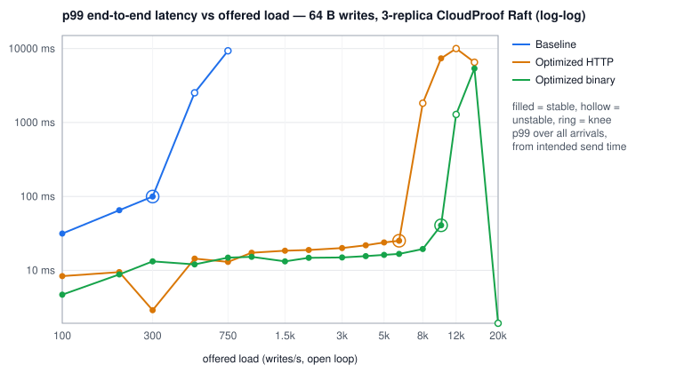
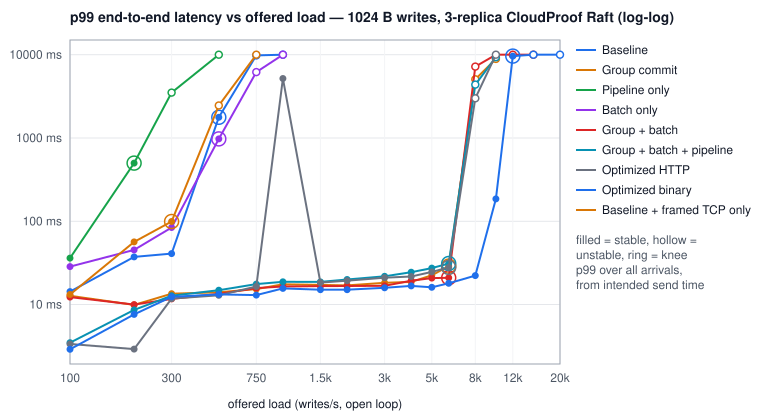
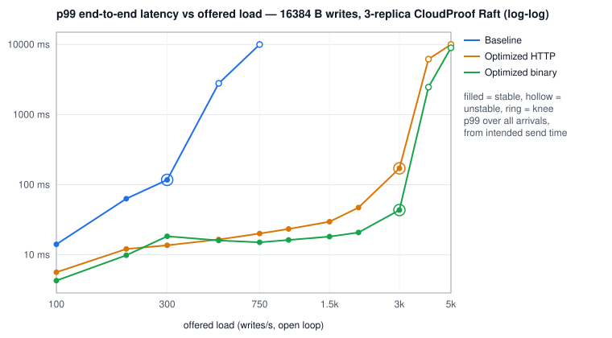

# Phase IV-A generated benchmark report

_Generated by `node tools/raft-bench-report.js` from the raw trial records. Do not edit by hand._

## Saturation knees

| configuration | payload | knee (offered/s) | max stable (achieved/s) | first unstable/s | peak achieved at any rate/s | p50 @knee ms | p99 @knee ms | p99.9 @knee ms |
|---|---:|---:|---:|---:|---:|---:|---:|---:|
| Baseline | 64 B | 300 | 299 | 500 | 648 | 6.81 | 99.58 | 106.69 |
| Baseline | 1024 B | 500 | 502 | 750 | 664 | 6.67 | 1768.45 | 1874.94 |
| Baseline | 16384 B | 300 | 300 | 500 | 601 | 9.19 | 117.31 | 131.71 |
| Group commit | 1024 B | 6,000 | 5,999 | 8,000 | 8,395 | 16.85 | 28.91 | 34.53 |
| Pipeline only | 1024 B | 200 | 200 | 300 | 422 | 320.00 | 498.94 | 522.24 |
| Batch only | 1024 B | 500 | 502 | 750 | 818 | 110.91 | 973.31 | 1007.62 |
| Group + batch | 1024 B | 6,000 | 6,000 | 8,000 | 10,352 | 5.80 | 20.94 | 25.25 |
| Group + batch + pipeline | 1024 B | 6,000 | 6,000 | 8,000 | 8,665 | 20.57 | 31.09 | 40.35 |
| Optimized HTTP | 64 B | 6,000 | 6,000 | 8,000 | 9,417 | 16.89 | 25.14 | 31.15 |
| Optimized HTTP | 1024 B | 6,000 | 6,001 | 8,000 | 8,350 | 18.73 | 27.95 | 32.99 |
| Optimized HTTP | 16384 B | 3,000 | 3,013 | 4,000 | 3,517 | 38.98 | 170.88 | 259.33 |
| Optimized binary | 64 B | 10,000 | 9,995 | 12,000 | 13,930 | 12.56 | 40.64 | 48.35 |
| Optimized binary | 1024 B | 12,000 | 10,600 | 15,000 | 12,177 | 9.46 | 9625.60 | 9666.56 |
| Optimized binary | 16384 B | 3,000 | 3,003 | 4,000 | 3,898 | 15.54 | 43.49 | 57.41 |
| Baseline + framed TCP only | 1024 B | 300 | 300 | 500 | 538 | 45.09 | 99.26 | 155.90 |

## Headline — 64 B (speedup vs the interleaved baseline of this sweep)

| profile | stable throughput (ops/s) | vs interleaved baseline | knee (offered/s, stable reps) | knee p99 ms | knee p99.9 ms | p99 @ 0.8x knee ms | CPU µs/op | fsync+meta / op | entries / fsync | AppendEntries / op | entries / AppendEntries |
|---|---:|---:|---|---:|---:|---:|---:|---:|---:|---:|---:|
| Baseline | 299 | 1.0x | 300 (3/3) | 99.58 | 106.69 | 69.76 | 1111 | 3.437 | 1.0 | 0.954 | 4.7 |
| Optimized HTTP | 6,000 | 20.0x | 6,000 (3/3) | 25.14 | 31.15 | 48.32 | 143 | 0.264 | 47.3 | 0.253 | 8.1 |
| Optimized binary | 9,995 | 33.4x | 10,000 (3/3) | 40.64 | 48.35 | 154.37 | 71 | 0.105 | 48.9 | 0.083 | 35.0 |

## Headline — 1024 B (speedup vs the interleaved baseline of this sweep)

| profile | stable throughput (ops/s) | vs interleaved baseline | knee (offered/s, stable reps) | knee p99 ms | knee p99.9 ms | p99 @ 0.8x knee ms | CPU µs/op | fsync+meta / op | entries / fsync | AppendEntries / op | entries / AppendEntries |
|---|---:|---:|---|---:|---:|---:|---:|---:|---:|---:|---:|
| Baseline | 502 | 1.0x | 500 (3/5) | 1768.45 | 1874.94 | 277.76 | 723 | 2.688 | 1.0 | 0.649 | 3.7 |
| Group commit | 5,999 | 12.0x | 6,000 (5/5) | 28.91 | 34.53 | 1007.10 | 114 | 0.096 | 29.1 | 0.049 | 49.0 |
| Pipeline only | 200 | 0.4x | 200 (5/5) | 498.94 | 522.24 | 432.64 | 1151 | 3.673 | 1.0 | 1.058 | 3.2 |
| Batch only | 502 | 1.0x | 500 (4/5) | 973.31 | 1007.62 | 121.53 | 459 | 1.599 | 1.0 | 0.231 | 29.3 |
| Group + batch | 6,000 | 12.0x | 6,000 (5/5) | 20.94 | 25.25 | 24.14 | 123 | 0.170 | 15.5 | 0.083 | 30.6 |
| Group + batch + pipeline | 6,000 | 12.0x | 6,000 (5/5) | 31.09 | 40.35 | 35.36 | 150 | 0.198 | 54.9 | 0.184 | 12.0 |
| Optimized HTTP | 6,001 | 12.0x | 6,000 (5/5) | 27.95 | 32.99 | 42.37 | 125 | 0.147 | 48.3 | 0.146 | 14.9 |
| Optimized binary | 10,600 | 21.1x | 12,000 (3/5) | 9625.60 | 9666.56 | 3004.41 | 76 | 0.091 | 50.8 | 0.069 | 40.0 |
| Baseline + framed TCP only | 300 | 0.6x | 300 (5/5) | 99.26 | 155.90 | 69.69 | 693 | 2.598 | 1.0 | 0.597 | 6.4 |

## Headline — 16384 B (speedup vs the interleaved baseline of this sweep)

| profile | stable throughput (ops/s) | vs interleaved baseline | knee (offered/s, stable reps) | knee p99 ms | knee p99.9 ms | p99 @ 0.8x knee ms | CPU µs/op | fsync+meta / op | entries / fsync | AppendEntries / op | entries / AppendEntries |
|---|---:|---:|---|---:|---:|---:|---:|---:|---:|---:|---:|
| Baseline | 300 | 1.0x | 300 (3/3) | 117.31 | 131.71 | 60.09 | 1223 | 2.954 | 1.0 | 0.755 | 5.7 |
| Optimized HTTP | 3,013 | 10.0x | 3,000 (3/3) | 170.88 | 259.33 | 57.38 | 316 | 0.167 | 46.8 | 0.165 | 14.8 |
| Optimized binary | 3,003 | 10.0x | 3,000 (3/3) | 43.49 | 57.41 | 29.17 | 250 | 0.273 | 16.8 | 0.228 | 9.8 |

## Key comparison — 64 B

| configuration | stable throughput (ops/s) | p99 @ knee (ms) | fsync + meta per op | entries / AppendEntries | leader CPU % @ knee |
|---|---:|---:|---:|---:|---:|
| Baseline | 299 | 99.58 | 3.437 | 4.7 | 33 |
| Optimized HTTP | 6,000 | 25.14 | 0.264 | 8.1 | 86 |
| Optimized binary | 9,995 | 40.64 | 0.105 | 35.0 | 71 |

## Key comparison — 1024 B

| configuration | stable throughput (ops/s) | p99 @ knee (ms) | fsync + meta per op | entries / AppendEntries | leader CPU % @ knee |
|---|---:|---:|---:|---:|---:|
| Baseline | 502 | 1768.45 | 2.688 | 3.7 | 36 |
| Group commit | 5,999 | 28.91 | 0.096 | 49.0 | 68 |
| Pipeline only | 200 | 498.94 | 3.673 | 3.2 | 23 |
| Batch only | 502 | 973.31 | 1.599 | 29.3 | 23 |
| Group + batch | 6,000 | 20.94 | 0.170 | 30.6 | 74 |
| Group + batch + pipeline | 6,000 | 31.09 | 0.198 | 12.0 | 90 |
| Optimized HTTP | 6,001 | 27.95 | 0.147 | 14.9 | 75 |
| Optimized binary | 10,600 | 9625.60 | 0.091 | 40.0 | 90 |
| Baseline + framed TCP only | 300 | 99.26 | 2.598 | 6.4 | 21 |

## Key comparison — 16384 B

| configuration | stable throughput (ops/s) | p99 @ knee (ms) | fsync + meta per op | entries / AppendEntries | leader CPU % @ knee |
|---|---:|---:|---:|---:|---:|
| Baseline | 300 | 117.31 | 2.954 | 5.7 | 37 |
| Optimized HTTP | 3,013 | 170.88 | 0.167 | 14.8 | 95 |
| Optimized binary | 3,003 | 43.49 | 0.273 | 9.8 | 75 |

## Disk-regime sensitivity — 64 B

Each trial is assigned the fsync regime of the disk sentinel sampled immediately before it (fast < 0.5 ms <= intermediate < 1.5 ms <= slow, median of 300 bare append+fsync). No trial is excluded from the overall results above; this view regroups the same trials.

| configuration | disk regime | trials | sentinel median fsync ms | regime knee (offered/s) | achieved @ regime knee | gaps below knee | achieved @ overall knee (n) | p99 @ overall knee ms |
|---|---|---:|---:|---:|---:|---|---:|---:|
| Baseline | fast | 7 | 0.33 | 300 | 299 (3) | — | 299 (3) | 99.58 |
| Baseline | slow | 8 | 1.69 | 200 | 200 (2) | — | — (0) | — |
| Optimized HTTP | fast | 19 | 0.32 | 10,000 | 9,992 (1) | 1000, 4000 | 6,000 (1) | 25.18 |
| Optimized HTTP | slow | 29 | 1.70 | 6,000 | 6,000 (2) | 300 | 6,000 (2) | 25.12 |
| Optimized binary | fast | 35 | 0.33 | 10,000 | 9,995 (3) | 3000 | 9,995 (3) | 40.64 |
| Optimized binary | slow | 16 | 1.69 | 5,000 | 5,000 (1) | 100, 200 | — (0) | — |

## Disk-regime sensitivity — 1024 B

Each trial is assigned the fsync regime of the disk sentinel sampled immediately before it (fast < 0.5 ms <= intermediate < 1.5 ms <= slow, median of 300 bare append+fsync). No trial is excluded from the overall results above; this view regroups the same trials.

| configuration | disk regime | trials | sentinel median fsync ms | regime knee (offered/s) | achieved @ regime knee | gaps below knee | achieved @ overall knee (n) | p99 @ overall knee ms |
|---|---|---:|---:|---:|---:|---|---:|---:|
| Baseline | fast | 19 | 0.33 | 300 | 300 (5) | — | 492 (2) | 419.84 |
| Baseline | slow | 11 | 1.72 | 500 | 508 (3) | 100, 300 | 508 (3) | 1801.21 |
| Group commit | fast | 25 | 0.33 | 6,000 | 5,998 (2) | 1000 | 5,998 (2) | 26.72 |
| Group commit | slow | 45 | 1.74 | 6,000 | 6,000 (3) | — | 6,000 (3) | 29.68 |
| Pipeline only | fast | 11 | 0.35 | 200 | 200 (2) | — | 200 (2) | 6.61 |
| Pipeline only | slow | 9 | 1.71 | 200 | 199 (3) | 100 | 199 (3) | 504.06 |
| Batch only | fast | 11 | 0.31 | 200 | 200 (3) | — | 498 (2) | 241.66 |
| Batch only | slow | 19 | 1.67 | 500 | 505 (3) | — | 505 (3) | 984.06 |
| Group + batch | fast | 41 | 0.33 | 6,000 | 6,001 (2) | — | 6,001 (2) | 9.10 |
| Group + batch | slow | 39 | 1.74 | 6,000 | 6,000 (3) | 100 | 6,000 (3) | 21.81 |
| Group + batch + pipeline | fast | 37 | 0.34 | 8,000 | 8,003 (1) | 1000 | 6,000 (2) | 31.95 |
| Group + batch + pipeline | slow | 33 | 1.78 | 6,000 | 6,000 (3) | 100 | 6,000 (3) | 30.77 |
| Optimized HTTP | fast | 37 | 0.33 | 6,000 | 6,000 (1) | 750 | 6,000 (1) | 28.51 |
| Optimized HTTP | slow | 33 | 1.71 | 6,000 | 6,001 (4) | 100, 200, 4000 | 6,001 (4) | 27.79 |
| Optimized binary | fast | 43 | 0.32 | 12,000 | 12,023 (3) | 1000 | 12,023 (3) | 109.18 |
| Optimized binary | slow | 42 | 1.72 | 10,000 | 10,066 (2) | 100 | 8,466 (2) | 9641.98 |
| Baseline + framed TCP only | fast | 16 | 0.34 | 300 | 300 (3) | — | 300 (3) | 103.74 |
| Baseline + framed TCP only | slow | 9 | 1.66 | 300 | 300 (2) | 100 | 300 (2) | 70.33 |

## Disk-regime sensitivity — 16384 B

Each trial is assigned the fsync regime of the disk sentinel sampled immediately before it (fast < 0.5 ms <= intermediate < 1.5 ms <= slow, median of 300 bare append+fsync). No trial is excluded from the overall results above; this view regroups the same trials.

| configuration | disk regime | trials | sentinel median fsync ms | regime knee (offered/s) | achieved @ regime knee | gaps below knee | achieved @ overall knee (n) | p99 @ overall knee ms |
|---|---|---:|---:|---:|---:|---|---:|---:|
| Baseline | fast | 10 | 0.33 | 300 | 300 (1) | — | 300 (1) | 12.37 |
| Baseline | slow | 5 | 1.88 | 300 | 301 (2) | 100 | 301 (2) | 120.32 |
| Optimized HTTP | fast | 15 | 0.34 | 3,000 | 2,999 (1) | 2000 | 2,999 (1) | 96.83 |
| Optimized HTTP | slow | 18 | 1.79 | 3,000 | 3,020 (2) | 100 | 3,020 (2) | 201.60 |
| Optimized binary | fast | 16 | 0.33 | 2,000 | 2,000 (2) | — | — (0) | — |
| Optimized binary | slow | 17 | 1.78 | 3,000 | 3,003 (3) | 100 | 3,003 (3) | 43.49 |

## Configuration comparison — 64 B

| configuration | max stable ops/s | p99 @50% ms | p99 @80% ms | p99 @knee ms | leader CPU % @knee | CPU µs/op | fsync+meta per op | AE RPC per op | entries/AE | repl bytes/op |
|---|---:|---:|---:|---:|---:|---:|---:|---:|---:|---:|
| Baseline | 299 | 42.40 | 69.76 | 99.58 | 33 | 1111 | 3.437 | 0.954 | 4.7 | 1,012 |
| Optimized HTTP | 6,000 | 33.25 | 48.32 | 25.14 | 86 | 143 | 0.264 | 0.253 | 8.1 | 479 |
| Optimized binary | 9,995 | 16.31 | 154.37 | 40.64 | 71 | 71 | 0.105 | 0.083 | 35.0 | 324 |

## Configuration comparison — 1024 B

| configuration | max stable ops/s | p99 @50% ms | p99 @80% ms | p99 @knee ms | leader CPU % @knee | CPU µs/op | fsync+meta per op | AE RPC per op | entries/AE | repl bytes/op |
|---|---:|---:|---:|---:|---:|---:|---:|---:|---:|---:|
| Baseline | 502 | 80.89 | 277.76 | 1768.45 | 36 | 723 | 2.688 | 0.649 | 3.7 | 2,671 |
| Group commit | 5,999 | 19.55 | 1007.10 | 28.91 | 68 | 114 | 0.096 | 0.049 | 49.0 | 2,258 |
| Pipeline only | 200 | 226.18 | 432.64 | 498.94 | 23 | 1151 | 3.673 | 1.058 | 3.2 | 3,108 |
| Batch only | 502 | 69.06 | 121.53 | 973.31 | 23 | 459 | 1.599 | 0.231 | 29.3 | 2,380 |
| Group + batch | 6,000 | 17.89 | 24.14 | 20.94 | 74 | 123 | 0.170 | 0.083 | 30.6 | 2,282 |
| Group + batch + pipeline | 6,000 | 25.89 | 35.36 | 31.09 | 90 | 150 | 0.198 | 0.184 | 12.0 | 2,357 |
| Optimized HTTP | 6,001 | 22.14 | 42.37 | 27.95 | 75 | 125 | 0.147 | 0.146 | 14.9 | 2,340 |
| Optimized binary | 10,600 | 20.13 | 3004.41 | 9625.60 | 90 | 76 | 0.091 | 0.069 | 40.0 | 2,243 |
| Baseline + framed TCP only | 300 | 42.98 | 69.69 | 99.26 | 21 | 693 | 2.598 | 0.597 | 6.4 | 2,323 |

## Configuration comparison — 16384 B

| configuration | max stable ops/s | p99 @50% ms | p99 @80% ms | p99 @knee ms | leader CPU % @knee | CPU µs/op | fsync+meta per op | AE RPC per op | entries/AE | repl bytes/op |
|---|---:|---:|---:|---:|---:|---:|---:|---:|---:|---:|
| Baseline | 300 | 36.80 | 60.09 | 117.31 | 37 | 1223 | 2.954 | 0.755 | 5.7 | 33,460 |
| Optimized HTTP | 3,013 | 29.12 | 57.38 | 170.88 | 95 | 316 | 0.167 | 0.165 | 14.8 | 35,228 |
| Optimized binary | 3,003 | 21.84 | 29.17 | 43.49 | 75 | 250 | 0.273 | 0.228 | 9.8 | 32,958 |

## CPU profiles (leader)

| profile | offered/s | achieved/s | busy % of wall | fs-sync-io | axios | express | node-http | streams-net | json | console-logging | raft-engine | raft-log-store | raft-transport | state-machine | gc | instrumentation |
|---|---:|---:|---:|---:|---:|---:|---:|---:|---:|---:|---:|---:|---:|---:|---:|---:|
| baseline 1024 B A-sub-saturation | 150 | 150 | 38.5 | 55.0 | 10.9 | 3.1 | 6.8 | 7.9 | 0.3 | 2.6 | 3.2 | 0.5 | 0.0 | 0.5 | 0.8 | 0.7 |
| baseline 1024 B B-knee | 300 | 300 | 63.4 | 61.6 | 8.6 | 3.5 | 5.3 | 7.0 | 0.3 | 2.1 | 3.4 | 0.7 | 0.0 | 0.5 | 0.5 | 0.3 |
| baseline 1024 B C-overloaded | 500 | 494 | 98.0 | 87.4 | 1.0 | 2.3 | 1.1 | 1.8 | 0.0 | 1.8 | 1.3 | 0.6 | 0.0 | 0.2 | 0.1 | 0.2 |

Category columns are percent of *busy* (non-idle) sampled time on the leader.

## Saturation curves

**Baseline — 64 B payload** (knee 300/s; first unstable 500/s)

| offered/s | achieved/s | p50 ms | p95 ms | p99 ms | p99.9 ms | max ms | err % | stable | leader CPU % | ELU | fsync/s (cluster) | meta/s (cluster) | AE/s | entries/AE | repl B/op |
|---:|---:|---:|---:|---:|---:|---:|---:|:---:|---:|---:|---:|---:|---:|---:|---:|
| 100 | 100 | 4.79 | 27.61 | 31.47 | 38.56 | 125.5 | 0.00 | 3/3 | 21 | 0.40 | 259 | 244 | 159 | 1.3 | 1,824 |
| 200 | 200 | 4.58 | 56.86 | 65.09 | 74.24 | 83.2 | 0.00 | 3/3 | 25 | 0.65 | 448 | 394 | 248 | 2.7 | 1,260 |
| 300 | 299 | 6.81 | 89.02 | 99.58 | 106.69 | 121.1 | 0.00 | 3/3 | 33 | 0.74 | 586 | 444 | 286 | 4.7 | 1,012 |
| 500 | 470 | 957.44 | 2342.91 | 2519.04 | 2662.40 | 2713.6 | 0.00 | 0/3 | 22 | 0.95 | 585 | 187 | 115 | 43.2 | 461 |
| 750 | 648 | 3487.74 | 8228.86 | 9330.69 | 9527.30 | 9565.9 | 0.00 | 0/3 | 21 | 0.99 | 704 | 97 | 57 | 35.6 | 358 |

**Baseline — 1024 B payload** (knee 500/s; first unstable 750/s)

| offered/s | achieved/s | p50 ms | p95 ms | p99 ms | p99.9 ms | max ms | err % | stable | leader CPU % | ELU | fsync/s (cluster) | meta/s (cluster) | AE/s | entries/AE | repl B/op |
|---:|---:|---:|---:|---:|---:|---:|---:|:---:|---:|---:|---:|---:|---:|---:|---:|
| 100 | 100 | 4.27 | 13.48 | 14.29 | 16.94 | 31.1 | 0.00 | 5/5 | 20 | 0.28 | 278 | 269 | 178 | 1.1 | 4,041 |
| 200 | 200 | 4.31 | 30.86 | 37.38 | 43.87 | 58.8 | 0.00 | 5/5 | 36 | 0.52 | 511 | 494 | 311 | 1.3 | 3,485 |
| 300 | 300 | 5.87 | 9.37 | 40.90 | 57.95 | 68.4 | 0.00 | 5/5 | 42 | 0.64 | 689 | 598 | 389 | 1.5 | 3,188 |
| 500 | 502 | 6.67 | 1420.29 | 1768.45 | 1874.94 | 1920.2 | 0.00 | 3/5 | 36 | 0.85 | 827 | 521 | 326 | 3.7 | 2,671 |
| 750 | 664 | 2623.49 | 8323.07 | 9805.82 | 10002.43 | 10020.6 | 6.90 | 0/5 | 32 | 1.00 | 806 | 272 | 141 | 29.7 | 2,362 |
| 1,000 | 637 | 5500.93 | 9609.22 | 10002.43 | 10002.43 | 10027.2 | 33.60 | 0/5 | 25 | 1.00 | 714 | 115 | 61 | 51.0 | 2,359 |

**Baseline — 16384 B payload** (knee 300/s; first unstable 500/s)

| offered/s | achieved/s | p50 ms | p95 ms | p99 ms | p99.9 ms | max ms | err % | stable | leader CPU % | ELU | fsync/s (cluster) | meta/s (cluster) | AE/s | entries/AE | repl B/op |
|---:|---:|---:|---:|---:|---:|---:|---:|:---:|---:|---:|---:|---:|---:|---:|---:|
| 100 | 100 | 4.22 | 13.73 | 14.09 | 14.94 | 16.7 | 0.00 | 3/3 | 21 | 0.28 | 281 | 273 | 181 | 1.1 | 34,792 |
| 200 | 200 | 36.32 | 56.77 | 63.13 | 68.29 | 72.7 | 0.00 | 3/3 | 23 | 0.93 | 308 | 194 | 108 | 4.1 | 33,327 |
| 300 | 300 | 9.19 | 102.53 | 117.31 | 131.71 | 138.9 | 0.00 | 3/3 | 37 | 0.81 | 527 | 360 | 227 | 5.7 | 33,460 |
| 500 | 496 | 9.18 | 2568.19 | 2789.38 | 2881.53 | 2927.2 | 0.00 | 0/3 | 43 | 0.93 | 734 | 402 | 236 | 9.8 | 33,330 |
| 750 | 601 | 3901.44 | 8953.85 | 10002.43 | 10002.43 | 10013.8 | 15.50 | 0/3 | 38 | 1.00 | 694 | 171 | 87 | 44.8 | 33,211 |

**Group commit — 1024 B payload** (knee 6,000/s; first unstable 8,000/s)

| offered/s | achieved/s | p50 ms | p95 ms | p99 ms | p99.9 ms | max ms | err % | stable | leader CPU % | ELU | fsync/s (cluster) | meta/s (cluster) | AE/s | entries/AE | repl B/op |
|---:|---:|---:|---:|---:|---:|---:|---:|:---:|---:|---:|---:|---:|---:|---:|---:|
| 100 | 100 | 2.22 | 5.36 | 12.73 | 15.06 | 18.3 | 0.00 | 5/5 | 17 | 0.23 | 292 | 28 | 192 | 1.0 | 4,294 |
| 200 | 200 | 1.92 | 7.05 | 9.89 | 14.02 | 105.0 | 0.00 | 5/5 | 23 | 0.38 | 577 | 28 | 377 | 1.1 | 3,933 |
| 300 | 300 | 6.05 | 10.95 | 13.51 | 16.18 | 20.5 | 0.00 | 5/5 | 24 | 0.71 | 689 | 28 | 393 | 1.6 | 3,194 |
| 500 | 500 | 1.64 | 11.44 | 14.05 | 17.07 | 47.5 | 0.00 | 5/5 | 37 | 0.76 | 1,103 | 29 | 682 | 1.8 | 3,289 |
| 750 | 750 | 8.60 | 13.10 | 15.32 | 18.48 | 23.8 | 0.00 | 5/5 | 32 | 0.97 | 796 | 28 | 427 | 3.7 | 2,633 |
| 1,000 | 1,000 | 9.21 | 14.23 | 17.49 | 31.54 | 45.7 | 0.00 | 5/5 | 36 | 0.98 | 828 | 28 | 422 | 5.2 | 2,514 |
| 1,500 | 1,501 | 9.34 | 14.34 | 17.23 | 22.83 | 34.9 | 0.00 | 5/5 | 47 | 1.00 | 992 | 28 | 492 | 7.1 | 2,448 |
| 2,000 | 2,000 | 9.22 | 14.41 | 16.96 | 21.31 | 31.6 | 0.00 | 5/5 | 53 | 1.00 | 1,090 | 28 | 553 | 7.8 | 2,413 |
| 3,000 | 3,001 | 10.81 | 15.78 | 18.25 | 22.21 | 27.9 | 0.00 | 5/5 | 51 | 1.00 | 763 | 28 | 393 | 16.8 | 2,312 |
| 4,000 | 4,001 | 5.42 | 16.05 | 18.72 | 21.92 | 30.9 | 0.00 | 5/5 | 69 | 1.00 | 1,040 | 29 | 542 | 16.2 | 2,316 |
| 5,000 | 5,001 | 13.44 | 19.54 | 22.45 | 27.26 | 41.3 | 0.00 | 5/5 | 65 | 1.00 | 704 | 28 | 372 | 32.9 | 2,275 |
| 6,000 | 5,999 | 16.85 | 25.21 | 28.91 | 34.53 | 46.6 | 0.00 | 5/5 | 68 | 1.00 | 550 | 28 | 294 | 49.0 | 2,258 |
| 8,000 | 7,306 | 1267.71 | 4759.55 | 5062.65 | 5206.02 | 5237.4 | 0.00 | 1/5 | 76 | 1.00 | 436 | 28 | 266 | 58.3 | 2,250 |
| 10,000 | 8,395 | 3368.96 | 7954.43 | 8888.32 | 9093.12 | 9129.0 | 0.00 | 2/5 | 82 | 0.99 | 404 | 28 | 261 | 64.4 | 2,234 |

**Pipeline only — 1024 B payload** (knee 200/s; first unstable 300/s)

| offered/s | achieved/s | p50 ms | p95 ms | p99 ms | p99.9 ms | max ms | err % | stable | leader CPU % | ELU | fsync/s (cluster) | meta/s (cluster) | AE/s | entries/AE | repl B/op |
|---:|---:|---:|---:|---:|---:|---:|---:|:---:|---:|---:|---:|---:|---:|---:|---:|
| 100 | 100 | 4.31 | 18.46 | 36.06 | 50.49 | 52.8 | 0.00 | 5/5 | 23 | 0.35 | 300 | 295 | 200 | 1.0 | 4,180 |
| 200 | 200 | 320.00 | 479.49 | 498.94 | 522.24 | 729.6 | 0.00 | 5/5 | 23 | 0.80 | 411 | 322 | 211 | 3.2 | 3,108 |
| 300 | 292 | 6.40 | 3121.15 | 3502.08 | 3627.01 | 3646.0 | 0.00 | 1/5 | 36 | 0.89 | 657 | 433 | 365 | 3.7 | 3,370 |
| 500 | 422 | 3981.31 | 9420.80 | 10002.43 | 10002.43 | 10027.7 | 12.30 | 0/5 | 27 | 1.00 | 592 | 306 | 168 | 6.5 | 2,490 |

**Batch only — 1024 B payload** (knee 500/s; first unstable 750/s)

| offered/s | achieved/s | p50 ms | p95 ms | p99 ms | p99.9 ms | max ms | err % | stable | leader CPU % | ELU | fsync/s (cluster) | meta/s (cluster) | AE/s | entries/AE | repl B/op |
|---:|---:|---:|---:|---:|---:|---:|---:|:---:|---:|---:|---:|---:|---:|---:|---:|
| 100 | 100 | 4.79 | 24.53 | 28.54 | 34.30 | 38.9 | 0.00 | 5/5 | 20 | 0.39 | 263 | 248 | 163 | 1.3 | 3,774 |
| 200 | 200 | 4.52 | 38.85 | 45.31 | 53.44 | 156.6 | 0.00 | 5/5 | 30 | 0.56 | 495 | 473 | 295 | 1.4 | 3,427 |
| 300 | 300 | 7.53 | 69.95 | 84.16 | 97.92 | 119.3 | 0.00 | 5/5 | 31 | 0.77 | 569 | 422 | 270 | 3.7 | 2,890 |
| 500 | 502 | 110.91 | 896.00 | 973.31 | 1007.62 | 1038.3 | 0.00 | 4/5 | 23 | 0.96 | 617 | 185 | 116 | 29.3 | 2,380 |
| 750 | 784 | 428.29 | 5144.57 | 6176.77 | 6406.14 | 6471.6 | 0.00 | 0/5 | 37 | 1.00 | 961 | 354 | 180 | 14.1 | 2,378 |
| 1,000 | 818 | 3301.38 | 9347.07 | 10002.43 | 10002.43 | 10021.9 | 13.40 | 0/5 | 34 | 1.00 | 927 | 203 | 103 | 50.3 | 2,306 |

**Group + batch — 1024 B payload** (knee 6,000/s; first unstable 8,000/s)

| offered/s | achieved/s | p50 ms | p95 ms | p99 ms | p99.9 ms | max ms | err % | stable | leader CPU % | ELU | fsync/s (cluster) | meta/s (cluster) | AE/s | entries/AE | repl B/op |
|---:|---:|---:|---:|---:|---:|---:|---:|:---:|---:|---:|---:|---:|---:|---:|---:|
| 100 | 100 | 2.03 | 3.81 | 12.29 | 13.30 | 14.1 | 0.00 | 5/5 | 16 | 0.19 | 291 | 28 | 191 | 1.0 | 4,305 |
| 200 | 200 | 1.95 | 7.74 | 9.97 | 13.81 | 18.3 | 0.00 | 5/5 | 23 | 0.38 | 573 | 28 | 373 | 1.1 | 3,824 |
| 300 | 300 | 1.80 | 9.35 | 11.70 | 14.86 | 141.3 | 0.00 | 5/5 | 33 | 0.53 | 808 | 29 | 509 | 1.2 | 3,592 |
| 500 | 500 | 1.64 | 11.23 | 13.42 | 16.77 | 20.1 | 0.00 | 5/5 | 38 | 0.74 | 1,152 | 29 | 714 | 1.7 | 3,316 |
| 750 | 750 | 7.92 | 13.02 | 15.78 | 65.22 | 177.3 | 0.00 | 5/5 | 37 | 0.94 | 982 | 28 | 549 | 3.2 | 2,768 |
| 1,000 | 1,000 | 3.10 | 13.04 | 16.48 | 33.95 | 71.0 | 0.00 | 5/5 | 47 | 0.93 | 1,408 | 29 | 727 | 3.8 | 2,722 |
| 1,500 | 1,500 | 8.28 | 14.03 | 16.66 | 19.73 | 26.3 | 0.00 | 5/5 | 49 | 1.00 | 1,172 | 29 | 587 | 6.5 | 2,491 |
| 2,000 | 2,001 | 9.39 | 14.36 | 16.70 | 20.09 | 123.4 | 0.00 | 5/5 | 46 | 1.00 | 902 | 28 | 452 | 9.0 | 2,378 |
| 3,000 | 3,001 | 8.00 | 14.54 | 16.78 | 19.95 | 26.7 | 0.00 | 5/5 | 57 | 1.00 | 1,165 | 29 | 584 | 13.0 | 2,356 |
| 4,000 | 4,001 | 10.37 | 16.54 | 19.31 | 23.15 | 31.9 | 0.00 | 5/5 | 57 | 1.00 | 929 | 28 | 466 | 19.3 | 2,302 |
| 5,000 | 4,999 | 12.42 | 18.08 | 20.77 | 24.27 | 29.6 | 0.00 | 5/5 | 59 | 1.00 | 695 | 28 | 349 | 34.6 | 2,272 |
| 6,000 | 6,000 | 5.80 | 17.92 | 20.94 | 25.25 | 32.2 | 0.00 | 5/5 | 74 | 1.00 | 994 | 29 | 498 | 30.6 | 2,282 |
| 8,000 | 7,426 | 83.39 | 6242.30 | 7196.67 | 7557.12 | 7576.2 | 0.00 | 2/5 | 73 | 0.90 | 591 | 27 | 309 | 57.5 | 2,254 |
| 10,000 | 9,418 | 10.63 | 10002.43 | 10002.43 | 10010.62 | 10031.0 | 5.20 | 4/5 | 85 | 0.96 | 609 | 28 | 317 | 62.7 | 2,248 |
| 12,000 | 10,352 | 1717.25 | 8970.24 | 10002.43 | 10002.43 | 10033.3 | 3.70 | 0/5 | 89 | 0.96 | 431 | 27 | 251 | 82.3 | 2,224 |
| 15,000 | 8,534 | 6729.73 | 10002.43 | 10002.43 | 10002.43 | 10030.7 | 28.00 | 0/5 | 94 | 0.99 | 490 | 28 | 265 | 80.6 | 2,243 |

**Group + batch + pipeline — 1024 B payload** (knee 6,000/s; first unstable 8,000/s)

| offered/s | achieved/s | p50 ms | p95 ms | p99 ms | p99.9 ms | max ms | err % | stable | leader CPU % | ELU | fsync/s (cluster) | meta/s (cluster) | AE/s | entries/AE | repl B/op |
|---:|---:|---:|---:|---:|---:|---:|---:|:---:|---:|---:|---:|---:|---:|---:|---:|
| 100 | 100 | 2.00 | 2.80 | 3.48 | 5.30 | 9.3 | 0.00 | 5/5 | 16 | 0.19 | 300 | 28 | 200 | 1.0 | 4,350 |
| 200 | 200 | 1.77 | 4.71 | 8.62 | 11.48 | 15.8 | 0.00 | 5/5 | 24 | 0.34 | 599 | 29 | 400 | 1.0 | 4,006 |
| 300 | 300 | 1.89 | 10.20 | 12.78 | 15.59 | 21.6 | 0.00 | 5/5 | 31 | 0.63 | 877 | 29 | 596 | 1.0 | 3,763 |
| 500 | 500 | 1.53 | 11.49 | 14.87 | 17.76 | 22.4 | 0.00 | 5/5 | 41 | 0.72 | 1,275 | 29 | 930 | 1.1 | 3,583 |
| 750 | 750 | 8.68 | 14.71 | 17.61 | 22.16 | 37.9 | 0.00 | 5/5 | 49 | 0.94 | 1,331 | 29 | 1,095 | 1.4 | 3,275 |
| 1,000 | 1,000 | 10.31 | 15.73 | 18.73 | 26.57 | 47.9 | 0.00 | 5/5 | 44 | 1.00 | 909 | 28 | 918 | 2.2 | 2,856 |
| 1,500 | 1,500 | 9.29 | 15.83 | 18.69 | 21.95 | 33.2 | 0.00 | 5/5 | 65 | 1.00 | 1,656 | 29 | 1,530 | 2.0 | 2,926 |
| 2,000 | 2,000 | 12.29 | 17.39 | 19.97 | 27.98 | 70.0 | 0.00 | 5/5 | 57 | 1.00 | 1,086 | 28 | 1,089 | 4.0 | 2,602 |
| 3,000 | 3,001 | 13.66 | 18.75 | 21.81 | 27.92 | 44.1 | 0.00 | 5/5 | 70 | 1.00 | 1,295 | 28 | 1,307 | 5.1 | 2,527 |
| 4,000 | 4,000 | 16.25 | 21.68 | 24.46 | 28.18 | 33.7 | 0.00 | 5/5 | 71 | 1.00 | 1,095 | 28 | 1,130 | 7.8 | 2,426 |
| 5,000 | 5,000 | 18.48 | 24.21 | 27.39 | 32.75 | 78.2 | 0.00 | 5/5 | 79 | 1.00 | 1,151 | 28 | 1,163 | 9.6 | 2,391 |
| 6,000 | 6,000 | 20.57 | 26.77 | 31.09 | 40.35 | 45.8 | 0.00 | 5/5 | 90 | 1.00 | 1,157 | 29 | 1,107 | 12.0 | 2,357 |
| 8,000 | 7,403 | 1861.63 | 4198.40 | 4374.53 | 4460.54 | 4481.5 | 0.00 | 1/5 | 79 | 1.00 | 728 | 28 | 601 | 28.8 | 2,290 |
| 10,000 | 8,665 | 1286.14 | 7675.90 | 9330.69 | 9691.14 | 9749.4 | 0.00 | 1/5 | 84 | 1.00 | 654 | 28 | 495 | 35.5 | 2,279 |

**Optimized HTTP — 64 B payload** (knee 6,000/s; first unstable 8,000/s)

| offered/s | achieved/s | p50 ms | p95 ms | p99 ms | p99.9 ms | max ms | err % | stable | leader CPU % | ELU | fsync/s (cluster) | meta/s (cluster) | AE/s | entries/AE | repl B/op |
|---:|---:|---:|---:|---:|---:|---:|---:|:---:|---:|---:|---:|---:|---:|---:|---:|
| 100 | 100 | 2.06 | 5.13 | 8.37 | 11.34 | 19.0 | 0.00 | 3/3 | 15 | 0.23 | 300 | 28 | 200 | 1.0 | 2,434 |
| 200 | 200 | 1.82 | 4.76 | 9.47 | 13.82 | 14.5 | 0.00 | 3/3 | 22 | 0.39 | 597 | 29 | 400 | 1.0 | 2,065 |
| 300 | 300 | 1.59 | 2.20 | 2.89 | 5.09 | 15.6 | 0.00 | 3/3 | 34 | 0.41 | 900 | 29 | 600 | 1.0 | 1,956 |
| 500 | 500 | 7.30 | 11.73 | 14.41 | 18.02 | 22.8 | 0.00 | 3/3 | 34 | 0.84 | 1,137 | 29 | 884 | 1.1 | 1,592 |
| 750 | 750 | 1.43 | 10.22 | 13.02 | 15.89 | 21.1 | 0.00 | 3/3 | 47 | 0.85 | 1,802 | 29 | 1,241 | 1.3 | 1,550 |
| 1,000 | 1,000 | 7.72 | 13.54 | 17.31 | 32.08 | 48.3 | 0.00 | 3/3 | 54 | 1.00 | 1,632 | 29 | 1,311 | 1.7 | 1,200 |
| 1,500 | 1,500 | 10.47 | 15.60 | 18.45 | 22.24 | 34.3 | 0.00 | 3/3 | 46 | 1.00 | 1,003 | 28 | 1,026 | 3.0 | 772 |
| 2,000 | 2,000 | 9.10 | 15.33 | 18.86 | 23.49 | 31.1 | 0.00 | 3/3 | 73 | 1.00 | 2,087 | 29 | 2,041 | 2.0 | 1,002 |
| 3,000 | 3,000 | 12.21 | 16.93 | 20.02 | 24.54 | 28.8 | 0.00 | 3/3 | 71 | 1.00 | 1,640 | 29 | 1,638 | 4.3 | 678 |
| 4,000 | 4,000 | 13.56 | 18.61 | 21.86 | 27.25 | 32.9 | 0.00 | 3/3 | 67 | 1.00 | 1,236 | 28 | 1,281 | 6.7 | 524 |
| 5,000 | 5,000 | 15.39 | 20.45 | 23.86 | 29.15 | 39.5 | 0.00 | 3/3 | 77 | 1.00 | 1,332 | 29 | 1,349 | 8.3 | 490 |
| 6,000 | 6,000 | 16.89 | 21.86 | 25.14 | 31.15 | 38.9 | 0.00 | 3/3 | 86 | 1.00 | 1,553 | 29 | 1,516 | 8.1 | 479 |
| 8,000 | 7,679 | 901.12 | 1768.45 | 1822.72 | 1838.08 | 1848.0 | 0.00 | 1/3 | 77 | 1.00 | 921 | 28 | 797 | 25.6 | 375 |
| 10,000 | 9,417 | 25.20 | 6705.15 | 7364.61 | 7475.20 | 7485.3 | 0.00 | 2/3 | 86 | 1.00 | 1,065 | 29 | 905 | 23.8 | 370 |
| 12,000 | 8,496 | 6049.79 | 10002.43 | 10002.43 | 10018.82 | 10033.8 | 24.60 | 0/3 | 69 | 1.00 | 629 | 28 | 486 | 34.9 | 346 |
| 15,000 | 8,620 | 3381.25 | 5156.86 | 6529.02 | 6803.45 | 6856.8 | 33.30 | 0/3 | 94 | 1.00 | 809 | 28 | 595 | 44.2 | 324 |

**Optimized HTTP — 1024 B payload** (knee 6,000/s; first unstable 8,000/s)

| offered/s | achieved/s | p50 ms | p95 ms | p99 ms | p99.9 ms | max ms | err % | stable | leader CPU % | ELU | fsync/s (cluster) | meta/s (cluster) | AE/s | entries/AE | repl B/op |
|---:|---:|---:|---:|---:|---:|---:|---:|:---:|---:|---:|---:|---:|---:|---:|---:|
| 100 | 100 | 1.97 | 2.76 | 3.36 | 4.71 | 9.0 | 0.00 | 5/5 | 15 | 0.18 | 300 | 28 | 200 | 1.0 | 4,360 |
| 200 | 200 | 1.69 | 2.21 | 2.92 | 4.77 | 17.9 | 0.00 | 5/5 | 25 | 0.28 | 600 | 29 | 400 | 1.0 | 4,044 |
| 300 | 300 | 1.79 | 9.23 | 11.80 | 15.24 | 23.2 | 0.00 | 5/5 | 33 | 0.58 | 884 | 29 | 598 | 1.0 | 3,796 |
| 500 | 500 | 1.39 | 9.90 | 12.90 | 16.15 | 22.2 | 0.00 | 5/5 | 43 | 0.65 | 1,376 | 29 | 960 | 1.0 | 3,707 |
| 750 | 750 | 8.53 | 13.60 | 16.45 | 25.02 | 42.1 | 0.00 | 5/5 | 45 | 0.94 | 1,278 | 29 | 1,075 | 1.4 | 3,249 |
| 1,000 | 1,000 | 9.54 | 1849.34 | 5181.44 | 5922.81 | 5991.9 | 0.00 | 4/5 | 51 | 1.00 | 1,357 | 27 | 1,130 | 2.1 | 3,012 |
| 1,500 | 1,500 | 5.99 | 15.28 | 18.34 | 21.61 | 25.6 | 0.00 | 5/5 | 68 | 1.00 | 1,907 | 29 | 1,698 | 1.8 | 3,007 |
| 2,000 | 2,000 | 10.65 | 16.21 | 19.33 | 23.45 | 32.2 | 0.00 | 5/5 | 71 | 1.00 | 1,721 | 29 | 1,700 | 2.4 | 2,813 |
| 3,000 | 3,000 | 13.26 | 18.40 | 21.02 | 24.88 | 34.5 | 0.00 | 5/5 | 57 | 1.00 | 944 | 28 | 1,014 | 6.4 | 2,460 |
| 4,000 | 4,000 | 14.38 | 19.15 | 21.71 | 25.77 | 32.4 | 0.00 | 5/5 | 77 | 1.00 | 1,595 | 29 | 1,574 | 5.7 | 2,494 |
| 5,000 | 4,999 | 16.45 | 21.50 | 24.69 | 30.72 | 47.0 | 0.00 | 5/5 | 80 | 1.00 | 1,324 | 29 | 1,331 | 8.6 | 2,415 |
| 6,000 | 6,001 | 18.73 | 25.17 | 27.95 | 32.99 | 39.0 | 0.00 | 5/5 | 75 | 1.00 | 853 | 28 | 874 | 14.9 | 2,340 |
| 8,000 | 7,612 | 1487.87 | 2637.82 | 2992.13 | 3057.66 | 3079.7 | 0.00 | 1/5 | 78 | 1.00 | 735 | 28 | 606 | 28.7 | 2,286 |
| 10,000 | 8,350 | 2056.19 | 9158.66 | 10002.43 | 10002.43 | 10032.5 | 2.00 | 2/5 | 80 | 1.00 | 708 | 28 | 563 | 30.7 | 2,288 |

**Optimized HTTP — 16384 B payload** (knee 3,000/s; first unstable 4,000/s)

| offered/s | achieved/s | p50 ms | p95 ms | p99 ms | p99.9 ms | max ms | err % | stable | leader CPU % | ELU | fsync/s (cluster) | meta/s (cluster) | AE/s | entries/AE | repl B/op |
|---:|---:|---:|---:|---:|---:|---:|---:|:---:|---:|---:|---:|---:|---:|---:|---:|
| 100 | 100 | 2.17 | 4.30 | 5.62 | 8.78 | 11.3 | 0.00 | 3/3 | 23 | 0.23 | 300 | 27 | 200 | 1.0 | 35,023 |
| 200 | 200 | 4.51 | 9.09 | 12.10 | 17.30 | 21.4 | 0.00 | 3/3 | 27 | 0.56 | 595 | 28 | 400 | 1.0 | 34,571 |
| 300 | 300 | 1.99 | 10.74 | 13.65 | 17.15 | 21.0 | 0.00 | 3/3 | 41 | 0.60 | 863 | 29 | 583 | 1.0 | 34,510 |
| 500 | 500 | 7.51 | 13.64 | 16.53 | 19.89 | 24.3 | 0.00 | 3/3 | 48 | 0.83 | 1,138 | 29 | 892 | 1.1 | 34,275 |
| 750 | 750 | 10.06 | 16.77 | 20.06 | 24.21 | 31.8 | 0.00 | 3/3 | 61 | 0.95 | 1,352 | 29 | 1,088 | 1.5 | 33,982 |
| 1,000 | 1,000 | 12.32 | 19.02 | 23.38 | 39.42 | 67.5 | 0.00 | 3/3 | 64 | 1.00 | 1,136 | 28 | 1,039 | 2.1 | 33,709 |
| 1,500 | 1,501 | 16.48 | 24.61 | 29.61 | 40.22 | 53.8 | 0.00 | 3/3 | 72 | 1.00 | 808 | 28 | 862 | 3.7 | 33,377 |
| 2,000 | 2,000 | 21.60 | 31.93 | 47.17 | 92.61 | 109.1 | 0.00 | 3/3 | 78 | 1.00 | 603 | 28 | 691 | 5.9 | 33,478 |
| 3,000 | 3,013 | 38.98 | 80.83 | 170.88 | 259.33 | 281.0 | 0.00 | 3/3 | 95 | 1.00 | 477 | 27 | 496 | 14.8 | 35,228 |
| 4,000 | 3,517 | 2205.70 | 5840.90 | 6184.96 | 6279.17 | 6311.7 | 0.00 | 0/3 | 95 | 1.00 | 271 | 26 | 216 | 33.4 | 33,770 |
| 5,000 | 3,341 | 8077.31 | 10002.43 | 10002.43 | 10018.82 | 10032.0 | 18.40 | 0/3 | 90 | 1.00 | 250 | 26 | 201 | 34.0 | 33,784 |

**Optimized binary — 64 B payload** (knee 10,000/s; first unstable 12,000/s)

| offered/s | achieved/s | p50 ms | p95 ms | p99 ms | p99.9 ms | max ms | err % | stable | leader CPU % | ELU | fsync/s (cluster) | meta/s (cluster) | AE/s | entries/AE | repl B/op |
|---:|---:|---:|---:|---:|---:|---:|---:|:---:|---:|---:|---:|---:|---:|---:|---:|
| 100 | 100 | 1.54 | 4.07 | 4.69 | 9.67 | 19.6 | 0.00 | 3/3 | 8 | 0.14 | 300 | 28 | 200 | 1.0 | 756 |
| 200 | 200 | 1.49 | 4.84 | 8.80 | 11.13 | 30.9 | 0.00 | 3/3 | 14 | 0.32 | 599 | 28 | 400 | 1.0 | 667 |
| 300 | 300 | 5.41 | 10.26 | 13.24 | 16.05 | 19.0 | 0.00 | 3/3 | 17 | 0.67 | 859 | 28 | 587 | 1.0 | 610 |
| 500 | 500 | 1.06 | 9.41 | 12.04 | 15.62 | 25.4 | 0.00 | 3/3 | 22 | 0.54 | 1,345 | 29 | 950 | 1.1 | 602 |
| 750 | 750 | 4.98 | 11.49 | 14.86 | 18.02 | 23.2 | 0.00 | 3/3 | 25 | 0.79 | 1,490 | 29 | 1,149 | 1.4 | 539 |
| 1,000 | 1,000 | 6.35 | 11.32 | 15.21 | 29.25 | 46.6 | 0.00 | 3/3 | 30 | 0.89 | 1,683 | 29 | 1,317 | 1.6 | 504 |
| 1,500 | 1,500 | 2.30 | 10.42 | 13.25 | 16.66 | 24.0 | 0.00 | 3/3 | 40 | 0.99 | 2,604 | 29 | 1,909 | 1.6 | 493 |
| 2,000 | 2,000 | 7.63 | 12.07 | 14.79 | 23.90 | 45.2 | 0.00 | 3/3 | 36 | 1.00 | 1,560 | 28 | 1,355 | 3.5 | 407 |
| 3,000 | 3,000 | 8.10 | 12.37 | 14.94 | 17.98 | 27.3 | 0.00 | 3/3 | 42 | 1.00 | 1,251 | 28 | 1,176 | 5.6 | 366 |
| 4,000 | 4,000 | 5.53 | 12.33 | 15.56 | 19.18 | 25.9 | 0.00 | 3/3 | 53 | 1.00 | 2,269 | 29 | 1,946 | 4.2 | 379 |
| 5,000 | 4,999 | 8.78 | 13.56 | 16.18 | 19.25 | 30.1 | 0.00 | 3/3 | 45 | 1.00 | 1,171 | 28 | 1,140 | 9.5 | 343 |
| 6,000 | 6,000 | 9.06 | 13.93 | 16.67 | 20.75 | 29.8 | 0.00 | 3/3 | 52 | 1.00 | 1,289 | 28 | 1,229 | 11.3 | 340 |
| 8,000 | 7,998 | 4.38 | 15.82 | 19.41 | 26.57 | 36.2 | 0.00 | 3/3 | 66 | 1.00 | 1,820 | 29 | 1,528 | 13.8 | 338 |
| 10,000 | 9,995 | 12.56 | 28.30 | 40.64 | 48.35 | 55.8 | 0.00 | 3/3 | 71 | 0.99 | 1,018 | 28 | 834 | 35.0 | 324 |
| 12,000 | 11,870 | 9.67 | 1170.43 | 1285.12 | 1297.41 | 1302.3 | 0.00 | 1/3 | 80 | 0.97 | 1,149 | 28 | 918 | 34.1 | 323 |
| 15,000 | 13,930 | 11.77 | 4730.88 | 5378.05 | 5529.60 | 5540.6 | 0.00 | 2/3 | 89 | 0.98 | 832 | 28 | 638 | 48.5 | 319 |
| 20,000 | 0 | — | — | — | — | — | 100.00 | 0/3 | — | — | — | — | — | — | — |

**Optimized binary — 1024 B payload** (knee 12,000/s; first unstable 15,000/s)

| offered/s | achieved/s | p50 ms | p95 ms | p99 ms | p99.9 ms | max ms | err % | stable | leader CPU % | ELU | fsync/s (cluster) | meta/s (cluster) | AE/s | entries/AE | repl B/op |
|---:|---:|---:|---:|---:|---:|---:|---:|:---:|---:|---:|---:|---:|---:|---:|---:|
| 100 | 100 | 1.57 | 2.35 | 2.90 | 3.90 | 9.6 | 0.00 | 5/5 | 10 | 0.13 | 300 | 28 | 200 | 1.0 | 2,684 |
| 200 | 200 | 1.43 | 4.28 | 7.62 | 9.66 | 14.1 | 0.00 | 5/5 | 15 | 0.28 | 599 | 29 | 400 | 1.0 | 2,601 |
| 300 | 300 | 4.68 | 9.81 | 12.39 | 16.16 | 25.3 | 0.00 | 5/5 | 17 | 0.68 | 863 | 28 | 589 | 1.0 | 2,534 |
| 500 | 500 | 1.16 | 10.25 | 13.24 | 16.26 | 19.1 | 0.00 | 5/5 | 22 | 0.63 | 1,253 | 29 | 922 | 1.1 | 2,511 |
| 750 | 750 | 1.06 | 9.80 | 12.99 | 16.59 | 25.8 | 0.00 | 5/5 | 33 | 0.67 | 1,935 | 29 | 1,360 | 1.1 | 2,506 |
| 1,000 | 1,000 | 7.59 | 12.38 | 15.63 | 28.00 | 76.7 | 0.00 | 5/5 | 32 | 0.93 | 1,442 | 28 | 1,197 | 1.8 | 2,401 |
| 1,500 | 1,500 | 7.85 | 12.43 | 15.05 | 18.59 | 38.0 | 0.00 | 5/5 | 36 | 1.00 | 1,734 | 28 | 1,427 | 2.4 | 2,366 |
| 2,000 | 1,999 | 7.24 | 12.13 | 15.06 | 17.77 | 27.8 | 0.00 | 5/5 | 41 | 1.00 | 2,171 | 29 | 1,788 | 2.4 | 2,358 |
| 3,000 | 3,000 | 8.31 | 13.05 | 15.88 | 19.38 | 32.1 | 0.00 | 5/5 | 44 | 1.00 | 1,575 | 28 | 1,440 | 4.8 | 2,298 |
| 4,000 | 4,000 | 8.42 | 13.82 | 16.73 | 20.38 | 27.6 | 0.00 | 5/5 | 49 | 1.00 | 1,607 | 28 | 1,490 | 6.1 | 2,283 |
| 5,000 | 5,000 | 2.65 | 12.07 | 16.09 | 22.09 | 34.3 | 0.00 | 5/5 | 64 | 1.00 | 2,603 | 29 | 2,197 | 4.6 | 2,293 |
| 6,000 | 6,000 | 9.38 | 14.95 | 17.97 | 21.71 | 30.6 | 0.00 | 5/5 | 57 | 1.00 | 1,503 | 28 | 1,340 | 10.6 | 2,262 |
| 8,000 | 8,001 | 4.87 | 17.66 | 22.25 | 30.96 | 38.6 | 0.00 | 5/5 | 72 | 1.00 | 1,638 | 29 | 1,342 | 14.4 | 2,255 |
| 10,000 | 10,024 | 4.50 | 76.35 | 185.47 | 200.45 | 214.6 | 0.00 | 5/5 | 82 | 0.99 | 1,611 | 29 | 1,315 | 16.0 | 2,250 |
| 12,000 | 10,600 | 9.46 | 9265.15 | 9625.60 | 9666.56 | 9673.9 | 0.00 | 3/5 | 90 | 0.99 | 936 | 28 | 731 | 40.0 | 2,243 |
| 15,000 | 12,177 | 2230.27 | 10002.43 | 10002.43 | 10018.82 | 10032.0 | 8.80 | 0/5 | 83 | 0.98 | 526 | 28 | 395 | 61.9 | 2,238 |
| 20,000 | 5,365 | 7778.30 | 10002.43 | 10002.43 | 10002.43 | 10024.6 | 66.50 | 0/5 | 95 | 1.00 | 683 | 28 | 532 | 49.8 | 2,240 |

**Optimized binary — 16384 B payload** (knee 3,000/s; first unstable 4,000/s)

| offered/s | achieved/s | p50 ms | p95 ms | p99 ms | p99.9 ms | max ms | err % | stable | leader CPU % | ELU | fsync/s (cluster) | meta/s (cluster) | AE/s | entries/AE | repl B/op |
|---:|---:|---:|---:|---:|---:|---:|---:|:---:|---:|---:|---:|---:|---:|---:|---:|
| 100 | 100 | 1.80 | 3.53 | 4.28 | 5.36 | 6.2 | 0.00 | 3/3 | 15 | 0.17 | 300 | 28 | 200 | 1.0 | 33,388 |
| 200 | 200 | 3.99 | 7.75 | 9.84 | 13.94 | 18.0 | 0.00 | 3/3 | 19 | 0.43 | 596 | 28 | 400 | 1.0 | 33,297 |
| 300 | 300 | 1.67 | 10.11 | 18.35 | 35.81 | 52.4 | 0.00 | 3/3 | 28 | 0.54 | 871 | 29 | 589 | 1.0 | 33,263 |
| 500 | 500 | 1.33 | 11.31 | 15.98 | 28.16 | 41.9 | 0.00 | 3/3 | 32 | 0.68 | 1,227 | 29 | 914 | 1.1 | 33,223 |
| 750 | 750 | 1.22 | 11.23 | 15.04 | 18.88 | 22.8 | 0.00 | 3/3 | 40 | 0.77 | 1,745 | 29 | 1,276 | 1.3 | 33,223 |
| 1,000 | 1,000 | 3.49 | 12.73 | 16.25 | 25.09 | 49.5 | 0.00 | 3/3 | 47 | 0.94 | 1,868 | 29 | 1,441 | 1.5 | 33,156 |
| 1,500 | 1,500 | 7.88 | 14.70 | 18.14 | 23.30 | 29.5 | 0.00 | 3/3 | 57 | 1.00 | 1,600 | 29 | 1,363 | 2.4 | 33,069 |
| 2,000 | 2,000 | 7.48 | 16.46 | 20.80 | 26.53 | 35.0 | 0.00 | 3/3 | 64 | 1.00 | 1,803 | 29 | 1,540 | 2.6 | 33,067 |
| 3,000 | 3,003 | 15.54 | 31.84 | 43.49 | 57.41 | 66.9 | 0.00 | 3/3 | 75 | 1.00 | 793 | 28 | 686 | 9.8 | 32,958 |
| 4,000 | 3,847 | 1449.98 | 2254.85 | 2465.79 | 2529.28 | 2552.6 | 0.00 | 1/3 | 88 | 0.94 | 196 | 25 | 236 | 33.5 | 32,970 |
| 5,000 | 3,898 | 4915.20 | 8085.50 | 8986.62 | 9216.00 | 9292.7 | 3.10 | 0/3 | 89 | 0.92 | 159 | 25 | 207 | 37.7 | 32,958 |

**Baseline + framed TCP only — 1024 B payload** (knee 300/s; first unstable 500/s)

| offered/s | achieved/s | p50 ms | p95 ms | p99 ms | p99.9 ms | max ms | err % | stable | leader CPU % | ELU | fsync/s (cluster) | meta/s (cluster) | AE/s | entries/AE | repl B/op |
|---:|---:|---:|---:|---:|---:|---:|---:|:---:|---:|---:|---:|---:|---:|---:|---:|
| 100 | 100 | 3.57 | 12.84 | 13.21 | 13.81 | 124.9 | 0.00 | 5/5 | 16 | 0.22 | 285 | 278 | 185 | 1.1 | 2,621 |
| 200 | 200 | 21.12 | 50.14 | 56.51 | 61.34 | 64.5 | 0.00 | 4/5 | 22 | 0.72 | 418 | 355 | 218 | 2.3 | 2,400 |
| 300 | 300 | 45.09 | 83.90 | 99.26 | 155.90 | 222.4 | 0.00 | 5/5 | 21 | 0.87 | 479 | 300 | 179 | 6.4 | 2,323 |
| 500 | 489 | 228.09 | 2312.19 | 2451.45 | 2607.10 | 2710.4 | 0.00 | 2/5 | 23 | 0.90 | 662 | 269 | 169 | 36.0 | 2,285 |
| 750 | 538 | 5005.31 | 9773.06 | 10002.43 | 10002.43 | 10027.8 | 9.40 | 0/5 | 21 | 0.99 | 609 | 126 | 70 | 52.2 | 2,248 |

## Input hashes

| file | trials | sha256 |
|---|---:|---|
| comparison/trials.jsonl | 801 | `8f2228fd07fe0ce938618eeada54d6b2b3bd851a88078ef7c00b31c3666ab8cd` |
