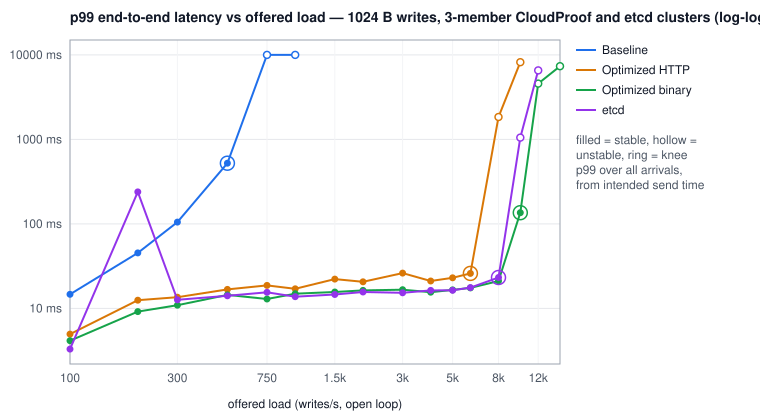

# Phase IV-A generated benchmark report

_Generated by `node tools/raft-bench-report.js` from the raw trial records. Do not edit by hand._

## Saturation knees

| configuration | payload | knee (offered/s) | max stable (achieved/s) | first unstable/s | peak achieved at any rate/s | p50 @knee ms | p99 @knee ms | p99.9 @knee ms |
|---|---:|---:|---:|---:|---:|---:|---:|---:|
| Baseline | 1024 B | 500 | 503 | 750 | 776 | 165.25 | 522.24 | 598.53 |
| Optimized HTTP | 1024 B | 6,000 | 6,001 | 8,000 | 8,626 | 17.02 | 25.95 | 32.13 |
| Optimized binary | 1024 B | 10,000 | 10,026 | 12,000 | 13,427 | 14.34 | 135.81 | 161.41 |
| etcd | 1024 B | 8,000 | 8,000 | 10,000 | 10,223 | 9.78 | 23.18 | 31.95 |

## Matched etcd comparison — 1024 B

| system | stable throughput (ops/s) | vs etcd | knee (offered/s, stable reps) | p99 @ 0.5x ms | p99 @ 0.8x ms | p99 @ knee ms | leader CPU % | leader CPU µs/op | cluster CPU µs/op | durable syncs / op | log·WAL fsyncs / op | meta·bbolt syncs / op | entries / leader fsync | repl bytes / op |
|---|---:|---:|---|---:|---:|---:|---:|---:|---:|---:|---:|---:|---:|---:|
| Baseline | 503 | 0.06x | 500 (3/5) | 83.71 | 244.61 | 522.24 | 35 | 698 | 1215 | 2.019 | 1.374 | 0.638 | 1.0 | 2,478 |
| Optimized HTTP | 6,001 | 0.75x | 6,000 (5/5) | 25.68 | 23.74 | 25.95 | 74 | 124 | 210 | 0.169 | 0.164 | 0.005 | 44.9 | 2,350 |
| Optimized binary | 10,026 | 1.25x | 10,000 (4/5) | 16.93 | 20.13 | 135.81 | 72 | 72 | 123 | 0.111 | 0.108 | 0.003 | 43.0 | 2,245 |
| etcd | 8,000 | 1.00x | 8,000 (5/5) | 19.20 | 18.14 | 23.18 | 322 | 403 | 486 | 0.146 | 0.142 | 0.004 | 18.6 | 4,307 |

CloudProof: log fsync and metadata save. etcd: WAL fsync and bbolt backend commit; durable syncs also count etcd's snapshot fsyncs. etcd replication bytes are raft message bytes on the followers' peer links, CloudProof's are TCP payload bytes on the followers' sockets. All values at each curve's own knee.

## Headline — 1024 B (speedup vs the interleaved baseline of this sweep)

| profile | stable throughput (ops/s) | vs interleaved baseline | knee (offered/s, stable reps) | knee p99 ms | knee p99.9 ms | p99 @ 0.8x knee ms | CPU µs/op | fsync+meta / op | entries / fsync | AppendEntries / op | entries / AppendEntries |
|---|---:|---:|---|---:|---:|---:|---:|---:|---:|---:|---:|
| Baseline | 503 | 1.0x | 500 (3/5) | 522.24 | 598.53 | 244.61 | 698 | 2.012 | 1.0 | 0.376 | 7.1 |
| Optimized HTTP | 6,001 | 11.9x | 6,000 (5/5) | 25.95 | 32.13 | 23.74 | 124 | 0.169 | 44.9 | 0.170 | 12.8 |
| Optimized binary | 10,026 | 19.9x | 10,000 (4/5) | 135.81 | 161.41 | 20.13 | 72 | 0.111 | 43.0 | 0.088 | 29.9 |
| etcd | 8,000 | 15.9x | 8,000 (5/5) | 23.18 | 31.95 | 18.14 | 403 | 0.146 | 18.6 | — | — |

## Key comparison — 1024 B

| configuration | stable throughput (ops/s) | p99 @ knee (ms) | fsync + meta per op | entries / AppendEntries | leader CPU % @ knee |
|---|---:|---:|---:|---:|---:|
| Baseline | 503 | 522.24 | 2.012 | 7.1 | 35 |
| Optimized HTTP | 6,001 | 25.95 | 0.169 | 12.8 | 74 |
| Optimized binary | 10,026 | 135.81 | 0.111 | 29.9 | 72 |
| etcd | 8,000 | 23.18 | 0.146 | — | 322 |

## Disk-regime sensitivity — 1024 B

Each trial is assigned the fsync regime of the disk sentinel sampled immediately before it (fast < 0.5 ms <= intermediate < 1.5 ms <= slow, median of 300 bare append+fsync). No trial is excluded from the overall results above; this view regroups the same trials.

| configuration | disk regime | trials | sentinel median fsync ms | regime knee (offered/s) | achieved @ regime knee | gaps below knee | achieved @ overall knee (n) | p99 @ overall knee ms |
|---|---|---:|---:|---:|---:|---|---:|---:|
| Baseline | fast | 18 | 0.36 | 300 | 300 (4) | — | 492 (1) | 349.44 |
| Baseline | intermediate | 1 | 0.60 | 200 | 200 (1) | 100 | — (0) | — |
| Baseline | slow | 11 | 1.76 | 500 | 505 (4) | 100, 200 | 505 (4) | 532.48 |
| Optimized HTTP | fast | 26 | 0.36 | 6,000 | 6,000 (1) | 2000, 3000 | 6,000 (1) | 25.79 |
| Optimized HTTP | intermediate | 2 | 0.52 | 1,500 | 1,500 (1) | 100, 200, 300, 500, 750 | — (0) | — |
| Optimized HTTP | slow | 42 | 1.75 | 6,000 | 6,001 (4) | 100, 300 | 6,001 (4) | 25.98 |
| Optimized binary | fast | 32 | 0.36 | 12,000 | 11,998 (2) | 4000, 5000, 6000 | 9,992 (3) | 32.93 |
| Optimized binary | intermediate | 3 | 0.51 | 2,000 | 2,000 (1) | 100, 300, 500, 750, 1000 | — (0) | — |
| Optimized binary | slow | 45 | 1.76 | 10,000 | 10,078 (2) | 100 | 10,078 (2) | 151.94 |
| etcd | fast | 31 | 0.36 | 8,000 | 7,998 (2) | 5000 | 7,998 (2) | 25.90 |
| etcd | intermediate | 4 | 0.53 | 2,000 | 2,000 (1) | 100, 200, 300, 500 | — (0) | — |
| etcd | slow | 40 | 1.78 | 8,000 | 8,001 (3) | 100, 500 | 8,001 (3) | 21.15 |

## Configuration comparison — 1024 B

| configuration | max stable ops/s | p99 @50% ms | p99 @80% ms | p99 @knee ms | leader CPU % @knee | CPU µs/op | fsync+meta per op | AE RPC per op | entries/AE | repl bytes/op |
|---|---:|---:|---:|---:|---:|---:|---:|---:|---:|---:|
| Baseline | 503 | 83.71 | 244.61 | 522.24 | 35 | 698 | 2.012 | 0.376 | 7.1 | 2,478 |
| Optimized HTTP | 6,001 | 25.68 | 23.74 | 25.95 | 74 | 124 | 0.169 | 0.170 | 12.8 | 2,350 |
| Optimized binary | 10,026 | 16.93 | 20.13 | 135.81 | 72 | 72 | 0.111 | 0.088 | 29.9 | 2,245 |
| etcd | 8,000 | 19.20 | 18.14 | 23.18 | 322 | 403 | 0.146 | — | — | 4,307 |

## Saturation curves

**Baseline — 1024 B payload** (knee 500/s; first unstable 750/s)

| offered/s | achieved/s | p50 ms | p95 ms | p99 ms | p99.9 ms | max ms | err % | stable | leader CPU % | ELU | fsync/s (cluster) | meta/s (cluster) | AE/s | entries/AE | repl B/op |
|---:|---:|---:|---:|---:|---:|---:|---:|:---:|---:|---:|---:|---:|---:|---:|---:|
| 100 | 100 | 4.44 | 13.68 | 14.68 | 16.30 | 49.9 | 0.00 | 5/5 | 24 | 0.31 | 279 | 270 | 179 | 1.1 | 4,077 |
| 200 | 200 | 5.16 | 37.85 | 45.38 | 51.39 | 89.0 | 0.00 | 5/5 | 34 | 0.59 | 473 | 443 | 273 | 1.7 | 3,344 |
| 300 | 300 | 7.59 | 90.50 | 105.02 | 118.53 | 129.6 | 0.00 | 5/5 | 42 | 0.74 | 597 | 470 | 297 | 3.9 | 2,930 |
| 500 | 503 | 165.25 | 425.47 | 522.24 | 598.53 | 628.7 | 0.00 | 3/5 | 35 | 0.93 | 691 | 321 | 189 | 7.1 | 2,478 |
| 750 | 627 | 2893.82 | 10002.43 | 10002.43 | 10002.43 | 10028.3 | 14.00 | 1/5 | 37 | 1.00 | 737 | 207 | 108 | 40.8 | 2,330 |
| 1,000 | 776 | 6053.89 | 10002.43 | 10002.43 | 10002.43 | 10030.4 | 23.30 | 0/5 | 28 | 1.00 | 829 | 46 | 29 | 58.3 | 2,340 |

**Optimized HTTP — 1024 B payload** (knee 6,000/s; first unstable 8,000/s)

| offered/s | achieved/s | p50 ms | p95 ms | p99 ms | p99.9 ms | max ms | err % | stable | leader CPU % | ELU | fsync/s (cluster) | meta/s (cluster) | AE/s | entries/AE | repl B/op |
|---:|---:|---:|---:|---:|---:|---:|---:|:---:|---:|---:|---:|---:|---:|---:|---:|
| 100 | 100 | 2.13 | 3.84 | 4.97 | 8.17 | 17.9 | 0.00 | 5/5 | 19 | 0.22 | 300 | 27 | 200 | 1.0 | 4,366 |
| 200 | 200 | 1.95 | 4.95 | 12.52 | 306.43 | 494.2 | 0.00 | 5/5 | 25 | 0.39 | 596 | 29 | 398 | 1.0 | 3,969 |
| 300 | 300 | 1.90 | 10.34 | 13.56 | 17.36 | 21.5 | 0.00 | 5/5 | 40 | 0.57 | 884 | 29 | 597 | 1.0 | 3,835 |
| 500 | 500 | 7.98 | 13.78 | 16.77 | 21.04 | 50.3 | 0.00 | 5/5 | 46 | 0.87 | 1,110 | 29 | 865 | 1.2 | 3,454 |
| 750 | 750 | 9.85 | 15.78 | 18.72 | 22.18 | 31.7 | 0.00 | 5/5 | 47 | 0.98 | 1,094 | 28 | 994 | 1.6 | 3,152 |
| 1,000 | 1,000 | 8.46 | 14.31 | 17.07 | 19.87 | 25.8 | 0.00 | 5/5 | 54 | 1.00 | 1,559 | 29 | 1,267 | 1.7 | 3,092 |
| 1,500 | 1,500 | 12.30 | 18.75 | 22.21 | 28.86 | 40.7 | 0.00 | 5/5 | 58 | 1.00 | 1,093 | 28 | 1,089 | 3.0 | 2,726 |
| 2,000 | 2,000 | 11.84 | 17.47 | 20.64 | 24.45 | 34.9 | 0.00 | 5/5 | 61 | 1.00 | 1,265 | 28 | 1,314 | 3.2 | 2,682 |
| 3,000 | 3,000 | 14.46 | 22.70 | 26.14 | 29.44 | 36.4 | 0.00 | 5/5 | 71 | 1.00 | 1,178 | 28 | 1,223 | 5.6 | 2,513 |
| 4,000 | 4,000 | 13.48 | 18.61 | 21.12 | 24.89 | 32.6 | 0.00 | 5/5 | 61 | 1.00 | 1,013 | 28 | 1,079 | 8.0 | 2,413 |
| 5,000 | 5,000 | 15.10 | 20.35 | 23.04 | 26.83 | 32.1 | 0.00 | 5/5 | 68 | 1.00 | 1,045 | 28 | 1,096 | 10.1 | 2,384 |
| 6,000 | 6,001 | 17.02 | 22.83 | 25.95 | 32.13 | 39.3 | 0.00 | 5/5 | 74 | 1.00 | 985 | 28 | 1,019 | 12.8 | 2,350 |
| 8,000 | 7,843 | 922.62 | 1802.24 | 1840.13 | 1862.65 | 1884.7 | 0.00 | 0/5 | 74 | 1.00 | 693 | 28 | 560 | 29.2 | 2,291 |
| 10,000 | 8,626 | 3444.74 | 7634.94 | 8200.19 | 8413.18 | 8458.9 | 0.00 | 1/5 | 77 | 1.00 | 705 | 28 | 552 | 32.7 | 2,280 |

**Optimized binary — 1024 B payload** (knee 10,000/s; first unstable 12,000/s)

| offered/s | achieved/s | p50 ms | p95 ms | p99 ms | p99.9 ms | max ms | err % | stable | leader CPU % | ELU | fsync/s (cluster) | meta/s (cluster) | AE/s | entries/AE | repl B/op |
|---:|---:|---:|---:|---:|---:|---:|---:|:---:|---:|---:|---:|---:|---:|---:|---:|
| 100 | 100 | 1.79 | 3.24 | 4.14 | 5.91 | 21.9 | 0.00 | 5/5 | 13 | 0.16 | 300 | 28 | 200 | 1.0 | 2,680 |
| 200 | 200 | 1.71 | 4.71 | 9.17 | 11.81 | 22.2 | 0.00 | 5/5 | 17 | 0.35 | 598 | 28 | 400 | 1.0 | 2,606 |
| 300 | 300 | 3.00 | 8.15 | 10.92 | 14.00 | 33.3 | 0.00 | 5/5 | 22 | 0.61 | 876 | 29 | 594 | 1.0 | 2,544 |
| 500 | 500 | 1.61 | 10.59 | 14.43 | 18.51 | 64.3 | 0.00 | 5/5 | 27 | 0.69 | 1,235 | 29 | 910 | 1.1 | 2,517 |
| 750 | 750 | 1.42 | 9.46 | 12.92 | 16.61 | 23.7 | 0.00 | 5/5 | 38 | 0.74 | 1,911 | 29 | 1,358 | 1.1 | 2,514 |
| 1,000 | 1,000 | 7.68 | 11.98 | 14.94 | 17.97 | 22.9 | 0.00 | 5/5 | 30 | 0.95 | 1,331 | 28 | 1,152 | 1.9 | 2,409 |
| 1,500 | 1,500 | 8.29 | 12.82 | 15.65 | 18.41 | 22.1 | 0.00 | 5/5 | 41 | 1.00 | 1,367 | 28 | 1,232 | 2.6 | 2,347 |
| 2,000 | 2,000 | 7.91 | 13.00 | 16.31 | 34.62 | 55.0 | 0.00 | 5/5 | 42 | 1.00 | 1,842 | 29 | 1,585 | 3.0 | 2,343 |
| 3,000 | 3,000 | 8.52 | 13.62 | 16.62 | 20.96 | 32.1 | 0.00 | 5/5 | 43 | 1.00 | 1,439 | 28 | 1,343 | 5.0 | 2,294 |
| 4,000 | 4,000 | 8.24 | 12.75 | 15.54 | 19.09 | 26.2 | 0.00 | 5/5 | 46 | 1.00 | 1,681 | 28 | 1,553 | 5.8 | 2,285 |
| 5,000 | 5,000 | 8.61 | 13.78 | 16.54 | 19.15 | 25.9 | 0.00 | 5/5 | 50 | 1.00 | 1,539 | 28 | 1,475 | 7.7 | 2,272 |
| 6,000 | 6,000 | 9.26 | 14.52 | 17.47 | 20.78 | 29.3 | 0.00 | 5/5 | 55 | 1.00 | 1,386 | 28 | 1,323 | 10.3 | 2,262 |
| 8,000 | 8,001 | 9.58 | 17.21 | 21.09 | 31.65 | 46.8 | 0.00 | 5/5 | 67 | 1.00 | 1,566 | 29 | 1,310 | 15.6 | 2,255 |
| 10,000 | 10,026 | 14.34 | 40.58 | 135.81 | 161.41 | 173.8 | 0.00 | 4/5 | 72 | 0.98 | 1,087 | 28 | 880 | 29.9 | 2,245 |
| 12,000 | 10,983 | 1762.30 | 4288.51 | 4579.33 | 4677.63 | 4697.1 | 0.00 | 2/5 | 75 | 0.96 | 844 | 28 | 656 | 57.9 | 2,240 |
| 15,000 | 13,427 | 1639.42 | 7319.55 | 7352.32 | 7376.90 | 7384.7 | 0.00 | 0/5 | 89 | 0.98 | 573 | 28 | 437 | 61.4 | 2,237 |

**etcd — 1024 B payload** (knee 8,000/s; first unstable 10,000/s)

| offered/s | achieved/s | p50 ms | p95 ms | p99 ms | p99.9 ms | max ms | err % | stable | leader CPU % | ELU | fsync/s (cluster) | meta/s (cluster) | AE/s | entries/AE | repl B/op |
|---:|---:|---:|---:|---:|---:|---:|---:|:---:|---:|---:|---:|---:|---:|---:|---:|
| 100 | 100 | 1.61 | 2.58 | 3.30 | 6.95 | 14.2 | 0.00 | 5/5 | 16 | — | 300 | 29 | — | — | 2,374 |
| 200 | 200 | 1.57 | 4.86 | 239.23 | 398.08 | 492.0 | 0.00 | 5/5 | 29 | — | 582 | 29 | — | — | 2,506 |
| 300 | 300 | 3.90 | 10.49 | 12.65 | 20.51 | 34.0 | 0.00 | 5/5 | 39 | — | 896 | 29 | — | — | 2,396 |
| 500 | 500 | 1.41 | 11.86 | 14.10 | 18.05 | 26.6 | 0.00 | 5/5 | 52 | — | 1,256 | 29 | — | — | 2,967 |
| 750 | 750 | 8.03 | 12.17 | 15.52 | 142.59 | 191.3 | 0.00 | 5/5 | 73 | — | 1,383 | 29 | — | — | 3,524 |
| 1,000 | 1,000 | 2.09 | 11.46 | 13.76 | 17.25 | 27.3 | 0.00 | 5/5 | 88 | — | 1,982 | 29 | — | — | 3,290 |
| 1,500 | 1,500 | 7.45 | 11.89 | 14.59 | 18.61 | 31.3 | 0.00 | 5/5 | 117 | — | 2,493 | 29 | — | — | 3,477 |
| 2,000 | 2,000 | 9.00 | 12.62 | 15.64 | 21.73 | 31.8 | 0.00 | 5/5 | 129 | — | 1,864 | 29 | — | — | 3,920 |
| 3,000 | 3,000 | 7.55 | 12.17 | 15.29 | 22.19 | 31.1 | 0.00 | 5/5 | 190 | — | 2,537 | 29 | — | — | 4,037 |
| 4,000 | 4,000 | 9.15 | 12.74 | 16.32 | 23.33 | 31.5 | 0.00 | 5/5 | 175 | — | 1,420 | 29 | — | — | 4,241 |
| 5,000 | 5,000 | 8.94 | 12.64 | 16.36 | 23.84 | 30.3 | 0.00 | 5/5 | 220 | — | 1,826 | 30 | — | — | 4,239 |
| 6,000 | 5,999 | 9.28 | 13.41 | 17.63 | 25.50 | 33.1 | 0.00 | 5/5 | 243 | — | 1,389 | 30 | — | — | 4,262 |
| 8,000 | 8,000 | 9.78 | 16.88 | 23.18 | 31.95 | 40.9 | 0.00 | 5/5 | 322 | — | 1,138 | 30 | — | — | 4,307 |
| 10,000 | 9,774 | 216.57 | 946.69 | 1050.62 | 1094.65 | 1114.3 | 0.00 | 1/5 | 342 | — | 1,496 | 30 | — | — | 4,430 |
| 12,000 | 10,223 | 2465.79 | 5795.84 | 6549.50 | 6766.59 | 6811.7 | 0.00 | 0/5 | 328 | — | 1,228 | 30 | — | — | 4,440 |

## Input hashes

| file | trials | sha256 |
|---|---:|---|
| etcd/trials.jsonl | 295 | `102695875f4e321659969be97e77705060d8f2c4b8b8d781a2edd807d7868396` |
